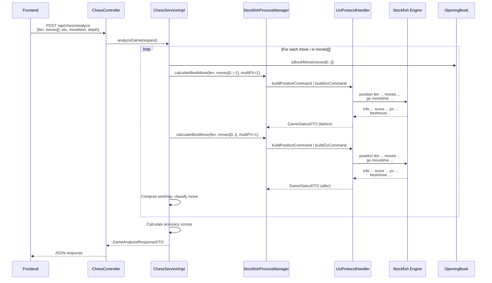

# Analyze Game — Backend Logic Documentation

## Overview

The **Analyze Game** feature takes a complete list of chess moves (a played game) and evaluates every single move using the Stockfish engine. It produces per-move classifications (brilliant, blunder, etc.), win-percentage tracking, and overall accuracy scores for both White and Black — similar to Chess.com's game review.

---

## Architecture & Data Flow



---

## Layer-by-Layer Breakdown

### 1. API Layer — [ChessController.java](file:///D:/Chess%20Engine/src/main/java/com/chessengine/controller/ChessController.java)

**Endpoint:** `POST /api/chess/analyze`

Accepts an [AnalyzeRequestDTO](file:///D:/Chess%20Engine/src/main/java/com/chessengine/dto/AnalyzeRequestDTO.java) with:

| Field | Type | Description |
|---|---|---|
| `fen` | `String` | Starting FEN (null = standard starting position) |
| `moves` | `List<String>` | Ordered list of moves played (UCI or SAN) |
| `pgn` | `String` | PGN string (currently unused in backend) |
| `elo` | `Integer` | Engine strength for analysis (default: 3200) |
| `movetime` | `Integer` | Time per position in ms (default: 150) |
| `depth` | `Integer` | Search depth override (optional) |

Returns a [GameAnalysisResponseDTO](file:///D:/Chess%20Engine/src/main/java/com/chessengine/dto/GameAnalysisResponseDTO.java).

---

### 2. Service Layer — [ChessServiceImpl.analyzeGame()](file:///D:/Chess%20Engine/src/main/java/com/chessengine/service/impl/ChessServiceImpl.java#L54-L247)

This is the **core analysis algorithm**. Here's exactly what it does:

#### Step 1: Initialization (Lines 56–76)

```
- If no moves provided → return empty analysis with 100% accuracy for both sides
- Default elo = 3200, default movetime = 150ms
- Initialize win-drop accumulators for White and Black
- Initialize classification counters (book, brilliant, great, best, excellent, good, inaccuracy, mistake, blunder, miss)
- Track `lastOpponentWinDrop` for "miss" detection
```

#### Step 2: Per-Move Loop (Lines 78–213)

For **every move `i`** in the game:

##### 2a. Determine context
- `playerColor` = `"white"` if even index, `"black"` if odd
- `movesBefore` = `moves[0..i-1]` (position before this move)
- `movesAfter` = `moves[0..i]` (position after this move)

##### 2b. Evaluate position BEFORE the move (MultiPV = 2)

```java
GameStatusDTO evalBefore = engineManager.calculateBestMove(
    fen, movesBefore, movetime, depth, elo, 2  // MultiPV=2
);
```

This gives us:
- **Best move** the engine recommends
- **Second-best move** (via MultiPV=2)
- **Score** (centipawns or mate) from the active player's perspective
- **Principal Variation** (PV line)

##### 2c. Evaluate position AFTER the move (MultiPV = 1)

```java
GameStatusDTO evalAfter = engineManager.calculateBestMove(
    fen, movesAfter, movetime, depth, elo, 1  // MultiPV=1
);
```

This gives us the opponent's evaluation. The player's score is **negated** (`cpAfterPlayer = -cpAfterOpponent`) because Stockfish always reports from the side to move.

##### 2d. Win Percentage Calculation

Uses a **logistic model** (similar to Lichess/Chess.com):

```java
winPct = 50.0 + 50.0 * (2.0 / (1.0 + exp(-0.00368208 * centipawns)) - 1.0)
```

| Centipawns | Win % |
|---|---|
| 0 | 50.0% |
| +100 | ~59.1% |
| +300 | ~75.1% |
| -200 | ~32.4% |
| +30000 (mate) | ~100% |

> [!NOTE]
> Values above are computed directly from the formula in this doc. The previous revision of this table had drifted (notably -200cp was listed as ~35.7% instead of the correct ~32.4%) — if you diff test output against this table, use the corrected numbers.

**Win Drop** = `max(0, winPctBefore - winPctAfter)` — how much winning chance was lost by this move.

##### 2e. Move Classification

The classification system follows this priority:

```
1. BOOK MOVE CHECK
   └─ Is move in the OpeningBook? → "book" (winDrop forced to 0)

2. BEST MOVE CHECK (played move == engine's #1 recommendation)
   ├─ Sacrifice + winDrop ≤ 5%  → "brilliant"  ✦
   ├─ Winning/critical position  → "great"      ‼
   └─ Otherwise                  → "best"       ★

3. NON-BEST MOVE (by win drop thresholds)
   ├─ winDrop ≤ 2%   → "excellent"
   ├─ winDrop ≤ 5%   → "good"
   ├─ winDrop ≤ 12%  → "inaccuracy"  ?!
   ├─ winDrop ≤ 25%  → "mistake"     ?
   └─ winDrop > 25%
       ├─ Was winning (≥65%) or opponent just blundered (≥20% drop) → "miss"
       └─ Otherwise → "blunder"  ??
```

> [!IMPORTANT]
> **Brilliant detection** uses a heuristic: the move must be the engine's top choice, involve a capture (`x`) or major piece move (`Q`/`R` prefix), and lose ≤5% win chance. This is a simplified approximation — Chess.com uses deeper analysis.
>
> Note this is not actually a sacrifice detector — any queen recapture or routine rook lift satisfies "capture or Q/R move" and would qualify as long as win-drop stays ≤5%. There's no check that material is actually being given up. Treat "brilliant" output from this system as a loose proxy, not a true sacrifice/only-move detector.

> [!TODO]
> **"Winning/critical position" threshold for `great` is undefined here.** Every other tier in the priority list has an explicit `winDrop ≤ X%` cutoff; "great" does not. Document the actual cp/win% threshold used in code (e.g. is "winning" ≥65%, same as the miss threshold below? is "critical" a separate check on position volatility?) so this table is complete.

> [!NOTE]
> **"Miss" vs "Blunder"** distinction: A "miss" occurs when the player was already winning (≥65% win chance) or the opponent just made a big mistake (≥20% win drop). It represents failing to capitalize on an advantage rather than creating a new disadvantage.

##### 2f. Mate Score Conversion

Mate scores are converted to large centipawn values for uniform win-percentage calculation:

```java
mate in +N  →  +30000 - (N × 100)   // e.g., mate in 3 = +29700
mate in -N  →  -30000 + (N × 100)   // e.g., mated in 3 = -29700
```

#### Step 3: Accuracy Calculation (Lines 215–219)

Uses an **exponential decay model**:

```java
accuracy = 103.1668 × exp(-0.04354 × avgWinDrop) - 3.1669
// Clamped to [0, 100]
```

| Avg Win Drop | Accuracy |
|---|---|
| 0.0 | 100.0% |
| 2.0 | 91.4% |
| 5.0 | 79.8% |
| 10.0 | 63.6% |
| 20.0 | 40.0% |
| 50.0 | 8.5% |

This is computed **separately** for White and Black based on their respective average win drops.

> [!NOTE]
> Same correction as the win-% table above — several rows here (5.0 and 10.0 in particular) had drifted from what the formula actually outputs. Recomputed directly from `103.1668 × exp(-0.04354 × x) - 3.1669`.

---

### 3. Engine Communication Layer

#### [StockfishProcessManager](file:///D:/Chess%20Engine/src/main/java/com/chessengine/engine/process/StockfishProcessManager.java)

- Manages a **single Stockfish OS process** via `ProcessBuilder`
- All access is **`synchronized`** — thread-safe but sequential (one analysis at a time)
- Auto-restarts the engine if the process dies
- For each `calculateBestMove()` call:
  1. Configures engine strength via UCI options
  2. Sets `MultiPV` (1 or 2)
  3. Sends `position` command with FEN + moves
  4. Sends `isready` / waits for `readyok`
  5. Sends `go` command
  6. Delegates output parsing to `UciProtocolHandler`

#### [UciProtocolHandler](file:///D:/Chess%20Engine/src/main/java/com/chessengine/engine/uci/UciProtocolHandler.java)

Handles all UCI protocol details:

- **Position commands**: `position fen <FEN> moves <move1> <move2> ...` or `position startpos moves ...`
- **Strength control**: 
  - ELO ≥ 3200 → Full strength (Skill Level 20, no limit)
  - ELO 1350–3199 → `UCI_LimitStrength = true`, `UCI_Elo = <value>`
  - ELO < 1350 → Skill Level mapped: `(elo - 400) / 50`
- **Search commands**: `go depth <N>` or `go movetime <ms>`
- **Output parsing**: Reads `info` lines for scores, PV, depth, nodes; stops at `bestmove`
- **Score normalization**: Negates scores when Black is to move (Stockfish always reports from side-to-move perspective)

---

### 4. Opening Book — [OpeningBook](file:///D:/Chess%20Engine/src/main/java/com/chessengine/util/OpeningBook.java)

A **static hardcoded set** of ~80 common opening move sequences (up to 16 half-moves / move 8):

- Italian Game, Ruy Lopez, Scotch, King's Gambit
- Sicilian Defense variants, French, Caro-Kann, Scandinavian
- Queen's Gambit (Declined/Accepted), Slav, King's Indian, Nimzo-Indian
- English, Reti, London System, Dutch, etc.

Matching is done by joining the move list with spaces and checking against the set. Moves beyond move 8 are never classified as book.

---

## Response Structure — [GameAnalysisResponseDTO](file:///D:/Chess%20Engine/src/main/java/com/chessengine/dto/GameAnalysisResponseDTO.java)

```json
{
  "evaluations": [
    {
      "moveIndex": 1,
      "moveNumber": 1,
      "playerColor": "white",
      "move": "e2e4",
      "bestMove": "e2e4",
      "secondBestMove": "d2d4",
      "ponderMove": "e7e5",
      "pv": "e2e4 e7e5 g1f3 b8c6",
      "evaluation": "+0.30",
      "scoreType": "cp",
      "scoreValue": 30,
      "evalCpBefore": 20,
      "evalCpAfter": 30,
      "winPercentageBefore": 53.6,
      "winPercentageAfter": 55.4,
      "winDrop": 0.0,
      "classification": "book",
      "depth": 20
    }
    // ... one per move
  ],
  "totalMoves": 40,
  "whiteAccuracy": 87.3,
  "blackAccuracy": 72.1,
  "whiteBookCount": 4,       "blackBookCount": 4,
  "whiteBrilliantCount": 1,   "blackBrilliantCount": 0,
  "whiteGreatCount": 2,       "blackGreatCount": 1,
  "whiteBestCount": 8,        "blackBestCount": 5,
  "whiteExcellentCount": 3,   "blackExcellentCount": 4,
  "whiteGoodCount": 1,        "blackGoodCount": 2,
  "whiteInaccuracyCount": 1,  "blackInaccuracyCount": 3,
  "whiteMistakeCount": 0,     "blackMistakeCount": 1,
  "whiteBlunderCount": 0,     "blackBlunderCount": 0,
  "whiteMissCount": 0,        "blackMissCount": 0
}
```

---

## Performance Characteristics

| Aspect | Detail |
|---|---|
| **Engine calls per move** | **2** (before + after) |
| **Total engine calls** | `2 × number_of_moves` |
| **Thread safety** | `synchronized` on `StockfishProcessManager` — sequential |
| **Default analysis time** | 150ms per position → ~300ms per move |
| **40-move game** | ~80 engine calls → ~12 seconds minimum |
| **Bottleneck** | Single Stockfish process, sequential evaluation |

> [!WARNING]
> The analysis is **blocking and synchronous**. A 40-move game with 150ms movetime takes ~12+ seconds. The HTTP request blocks until all moves are evaluated. There is no streaming/progress feedback to the frontend.

> [!TODO]
> **Redundant evaluations.** `movesBefore` for move `i` is the same position as `movesAfter` for move `i-1` — it gets evaluated twice: once at MultiPV=1 (as move `i-1`'s "after" state) and again at MultiPV=2 (as move `i`'s "before" state). Since MultiPV=2 output is a superset of MultiPV=1 output for the same position, the "after" evaluation for move `i-1` could likely be reused as the "before" evaluation for move `i`, roughly halving the engine call count (and the ~12s+ analysis time for a 40-move game). Worth confirming whether this caching is intentionally avoided for some reason (e.g. re-evaluating at different depth) before treating it as a straightforward win.

---

## Open Questions

These aren't answered by the current documentation and would be worth clarifying or adding:

- **Book moves and engine calls** — do book moves still trigger both `calculateBestMove()` calls, or short-circuit before hitting Stockfish? The example JSON response shows `bestMove`/`evaluation` populated even for the `"book"`-classified move, suggesting calls still happen — if so, that's wasted engine work for known theory.
- **`depth` vs `movetime` precedence** — when a request supplies both, which one does `UciProtocolHandler` honor when building the `go` command?
- **`pgn` field** — confirmed unused by the backend. Is it reserved for a future feature, or should it be removed from `AnalyzeRequestDTO` to avoid confusion?
- **Concurrent request handling** — given the single `synchronized` `StockfishProcessManager`, what happens to concurrent `/analyze` requests? Do they queue indefinitely, block until timeout, or get rejected?

---

## File Map

```
src/main/java/com/chessengine/
├── controller/
│   └── ChessController.java          # REST endpoint: POST /api/chess/analyze
├── service/
│   ├── ChessService.java             # Interface
│   └── impl/
│       └── ChessServiceImpl.java     # Core analysis algorithm
├── engine/
│   ├── process/
│   │   └── StockfishProcessManager.java  # OS process lifecycle + UCI I/O
│   └── uci/
│       └── UciProtocolHandler.java       # UCI command building + parsing
├── dto/
│   ├── AnalyzeRequestDTO.java        # Request payload
│   ├── GameAnalysisResponseDTO.java  # Full analysis response
│   ├── MoveAnalysisDTO.java          # Per-move evaluation data
│   └── GameStatusDTO.java           # Single engine evaluation result
├── util/
│   └── OpeningBook.java              # Static opening book lookup
└── config/
    └── EngineProperties.java         # Configurable defaults (elo, depth, movetime)
```
