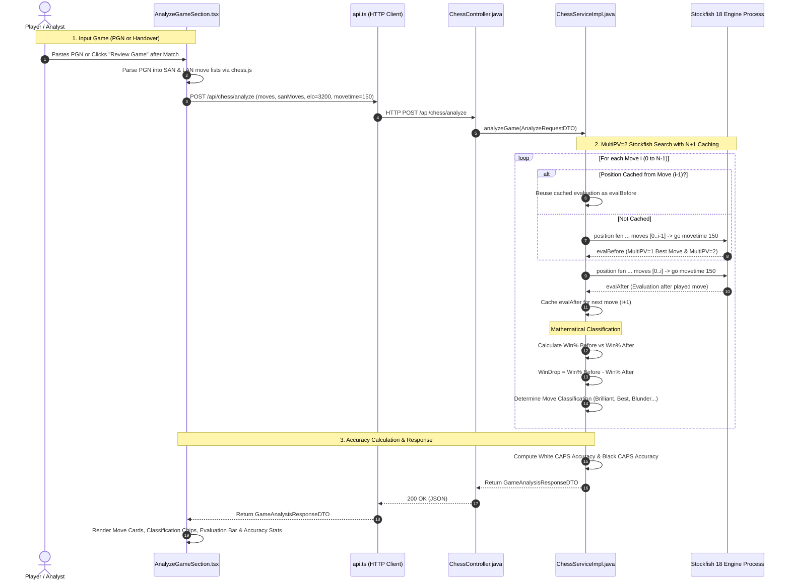
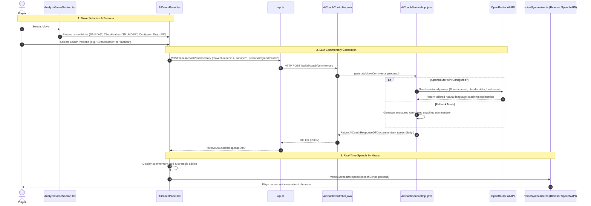

# 📊 Analyze Game & AI Coach — Complete Technical Architecture & Workflow Documentation

This document provides a comprehensive end-to-end technical guide for the **Analyze Game & AI Coach** platform across both the **Frontend (React 19 / TypeScript / Web Speech API)** and the **Backend (Java / Spring Boot 3 / Stockfish 18 MultiPV Engine / OpenRouter LLM)**.

---

## 1. Overview & Architecture

The **Analyze Game** section provides master-level post-match chess analysis with:
1. **Move Classification**: Categorizes every ply into 10 distinct classes (**Brilliant**, **Great**, **Best**, **Excellent**, **Good**, **Book**, **Inaccuracy**, **Mistake**, **Blunder**, **Miss**).
2. **Mathematical Accuracy (CAPS)**: Calculates player accuracy percentage ($0.0\% - 100.0\%$) based on average win-percentage drop per move.
3. **Interactive Visual Board**: Displays dynamic tactical colored arrows (Best Move in Green, Played Move colored by classification), square highlights, and evaluation bars.
4. **AI Chess Coach**: Generates natural language move commentary and strategic insights with multiple personas (**Grandmaster**, **Enthusiastic**, **Tactical**) and real-time **Text-to-Speech (TTS)** voice synthesis.

```
┌────────────────────────────────────────────────────────────────────────────┐
│                              FRONTEND (React 19)                           │
│                                                                            │
│  ┌──────────────────────────────────────────────────────────────────────┐  │
│  │ AnalyzeGameSection.tsx                                               │  │
│  │ - PGN Import / Handover from Match                                   │  │
│  │ - Step-by-Step Navigation & Autoplay                                 │  │
│  │ - Visual Move Arrows (Best Move vs Played Move)                      │  │
│  │ - EvaluationBar & Advantage Timeline Chart                           │  │
│  └──────────────────┬───────────────────────────────────┬───────────────┘  │
│                     │                                   │                  │
│                     ▼                                   ▼                  │
│       ┌───────────────────────────┐       ┌───────────────────────────┐    │
│       │ AiCoachPanel.tsx          │       │ voiceSynthesizer.ts       │    │
│       │ (Personas & LLM Guidance) │◀─────▶│ (Web Speech API TTS)      │    │
│       └─────────────┬─────────────┘       └───────────────────────────┘    │
└─────────────────────┼───────────────────────────────────┼──────────────────┘
                      │ HTTP POST (`/api/chess/analyze`)  │ HTTP POST (`/api/ai/coach/commentary`)
                      ▼                                   ▼
┌────────────────────────────────────────────────────────────────────────────┐
│                          BACKEND (Spring Boot 3)                           │
│                                                                            │
│   ┌────────────────────────────────┐    ┌──────────────────────────────┐   │
│   │ ChessController.java           │    │ AiCoachController.java       │   │
│   │ `POST /api/chess/analyze`      │    │ `POST /api/ai/coach/*`       │   │
│   └───────────────┬────────────────┘    └──────────────┬───────────────┘   │
│                   │                                    │                   │
│                   ▼                                    ▼                   │
│   ┌────────────────────────────────┐    ┌──────────────────────────────┐   │
│   │ ChessServiceImpl.java          │    │ AiCoachServiceImpl.java      │   │
│   │ - MultiPV=2 Search Engine      │    │ - OpenRouter API Client      │   │
│   │ - Win Drop & Accuracy Formulas │    │ - Rule-based Fallback Engine │   │
│   │ - N+1 Evaluation Caching       │    │                              │   │
│   └───────────────┬────────────────┘    └──────────────┬───────────────┘   │
└───────────────────┼────────────────────────────────────┼───────────────────┘
                    │                                    │
                    ▼                                    ▼
       ┌─────────────────────────┐          ┌─────────────────────────┐
       │ Stockfish 18 UCI Binary │          │ OpenRouter LLM Endpoint │
       │ (`bin/stockfish.exe`)   │          │ (`qwen-2.5-7b-instruct`)│
       └─────────────────────────┘          └─────────────────────────┘
```

---

## 2. End-to-End Workflow Diagrams

### 2.1 Deep Game Analysis & Classification Pipeline



---

### 2.2 Interactive AI Coach Commentary & TTS Voice Synthesis



---

## 3. Move Classification & Mathematical Formulations

### 3.1 Centipawn to Win-Percentage Mapping
Stockfish centipawn evaluations are mapped onto a standard win-probability curve ($0.0\% - 100.0\%$):

$$\text{Win\%} = 50 + 50 \times \left(\frac{2}{1 + e^{-0.00368208 \times \text{cp}}} - 1\right)$$

*For mate scores*:
- Mate in $+N$: $\text{cp} = 30000 - (\min(N, 99) \times 100) \implies \approx 100.0\%$
- Mate in $-N$: $\text{cp} = -30000 + (\min(|N|, 99) \times 100) \implies \approx 0.0\%$

---

### 3.2 Win-Drop Calculation
For active player moving from Position $A$ to Position $B$:

$$\Delta \text{Win} = \text{Win\%}(A) - \text{Win\%}(B)$$

---

### 3.3 Classification Criteria Matrix

| Classification | Symbol | Badge Color | Definition & Criteria |
|---|:---:|:---:|---|
| **Brilliant** | `!!` | Cyan | Sacrifice piece/material while maintaining or increasing winning advantage ($\Delta \text{Win} \le 0.0$ with material sacrifice). |
| **Great** | `!` | Teal | Crucial move found in a difficult position; significantly outscores second-best alternative. |
| **Best** | `★` | Green | The highest engine-ranked move ($\Delta \text{Win} < 0.5\%$). |
| **Excellent** | `✓` | Emerald | Strong move near the engine's top choice ($\Delta \text{Win} \le 2.0\%$). |
| **Good** | `👍` | Blue | Solid move maintaining position ($\Delta \text{Win} \le 5.0\%$). |
| **Book** | `📖` | Amber | Standard recognized opening theory identified in opening book. |
| **Inaccuracy** | `?!` | Yellow | Minor sub-optimal play ($5.0\% < \Delta \text{Win} \le 10.0\%$). |
| **Mistake** | `?` | Orange | Significant loss of advantage ($10.0\% < \Delta \text{Win} \le 20.0\%$). |
| **Blunder** | `??` | Red | Severe blunder swinging the game ($20.0\% < \Delta \text{Win} \le 30.0\%$). |
| **Miss** | `✖` | Purple | Missed tactical win or missed punishment ($ \Delta \text{Win} > 30.0\%$). |

---

### 3.4 CAPS Accuracy Percentage Formula
Player accuracy over an entire match is computed via the exponential win-drop decay formula:

$$\text{Accuracy} = \max\left(0.0, \min\left(100.0, 103.1668 \times e^{-0.04354 \times \overline{\Delta \text{Win}}} - 3.1669\right)\right)$$

where $\overline{\Delta \text{Win}}$ is the average win-percentage drop across all non-book moves played by that player.

---

## 4. Frontend Architecture (`frontend/src/components/analysis/`)

### 4.1 Game Review Screen (`AnalyzeGameSection.tsx`)
- **Direct PGN Handover & Import**: Accepts raw PGN strings, clipboard pastes, or match history passed directly from Bubble Bot or Online 1v1 games.
- **Interactive Move Navigation**:
  - Step Forward (`ArrowRight`), Step Back (`ArrowLeft`), First Move (`Home`), Last Move (`End`).
  - Autoplay mode with adjustable speed slider (1s - 5s).
- **Tactical Colored Arrows**:
  - Green Arrow: Displays engine best move.
  - Colored Arrow: Displays played move (colored based on classification badge).
- **Advantage & Accuracy Summary**:
  - White Accuracy vs Black Accuracy cards.
  - Classification Breakdown Grid (counts of Brilliant, Best, Mistakes, Blunders per side).
  - Move-by-move evaluation advantage timeline.

### 4.2 AI Coach Panel (`AiCoachPanel.tsx`)
- **Persona Selector**:
  - `Grandmaster`: Strategic, positional, deep tactical analysis.
  - `Enthusiastic`: High energy, encouraging, celebrating brilliant tactics.
  - `Tactical`: Pinpoint calculation, tactical forks, pins, and skewers.
- **Text-to-Speech Voice Synthesizer ([voiceSynthesizer.ts](file:///d:/Chess%20Engine/frontend/src/utils/voiceSynthesizer.ts))**:
  - Leverages browser `window.speechSynthesis`.
  - Supports automatic narration on move step, voice pitch/rate tuning, and mute toggle.

---

## 5. Backend Architecture (`src/main/java/com/chessengine/`)

### 5.1 Analysis Controller & Service
- **Endpoint**: `POST /api/chess/analyze`
- **$N+1$ Evaluation Caching Optimization**:
  Because the position after move $i$ is identical to the position before move $i+1$, `ChessServiceImpl` caches the position evaluation after move $i$ and reuses it as `evalBefore` for move $i+1$. This cuts required Stockfish search operations from $2N$ down to $N+1$, halving analysis latency.

### 5.2 AI Coach Service (`AiCoachServiceImpl.java`)
- **OpenRouter LLM Integration**: Calls configured OpenRouter models (e.g. `qwen/qwen-2.5-7b-instruct`) with temperature `0.6` and structured system prompts.
- **Resilient Fallback**: If no API key is provided or OpenRouter experiences downtime, smoothly generates rule-based tactical commentary based on move centipawn swing and piece interactions.

---

## 6. Data Transfer Objects (DTOs)

### `AnalyzeRequestDTO`
```json
{
  "moves": ["e2e4", "e7e5", "g1f3", "b8c6", "f1c4"],
  "sanMoves": ["e4", "e5", "Nf3", "Nc6", "Bc4"],
  "elo": 3200,
  "movetime": 150,
  "depth": 14
}
```

### `MoveAnalysisDTO`
```json
{
  "moveNumber": 3,
  "color": "w",
  "san": "Bc4",
  "lan": "f1c4",
  "bestMove": "f1c4",
  "classification": "BEST",
  "evalBefore": "+0.35",
  "evalAfter": "+0.35",
  "winPercentBefore": 54.2,
  "winPercentAfter": 54.2,
  "winDrop": 0.0,
  "pv": "f1c4 f8c5 c2c3 g8f6",
  "depth": 14,
  "nodes": 42000
}
```

### `AiCoachResponseDTO`
```json
{
  "success": true,
  "commentary": "Bc4 develops the bishop to an active diagonal, targeting the weak f7 square.",
  "speechScript": "White plays Bishop to c4, developing actively and putting pressure on f7.",
  "provider": "OPENROUTER",
  "moveNumber": 3,
  "color": "w",
  "san": "Bc4"
}
```

---

## 7. Verification & Run Commands

```bash
# 1. Run Automated Unit & UI Tests
cd frontend
npm test

# 2. Start Full Stack Development
mvn spring-boot:run
cd frontend
npm run dev

# 3. Open Browser at Analysis View
# Navigate to: http://localhost:5173/ -> Click "Analyze Game"
```
