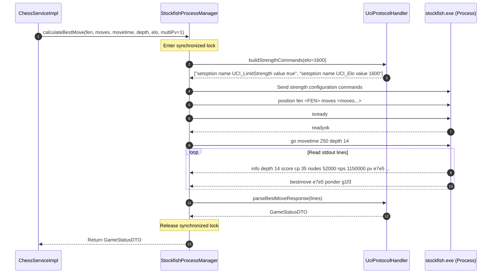
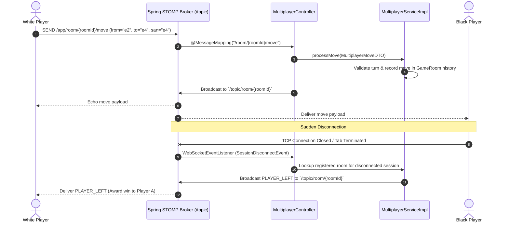
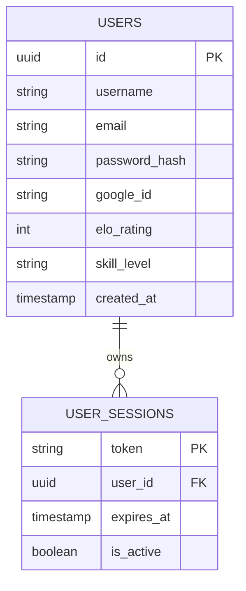

# 🏗️ Backend Architecture & Technical Specification

This document provides an exhaustive, low-level technical reference for the **Chess Engine Backend**, built on **Java 21 / 26**, **Spring Boot 3**, **Spring WebSocket & STOMP**, **Spring Data JPA**, and a **Native Stockfish 18 UCI Sub-Process**.

---

## 1. Executive System Architecture

The backend operates as a high-performance REST and WebSocket API server that coordinates:
1. **Stockfish 18 AI Engine Management**: Spawns and supervises native OS sub-processes using the Universal Chess Interface (UCI) protocol.
2. **Real-Time Multiplayer Messaging**: Implements STOMP over WebSockets for bi-directional, sub-millisecond move and chat synchronization.
3. **Automated Matchmaking**: Maintains a concurrent in-memory queue that pairs players based on ELO proximity and time controls.
4. **AI Chess Coaching**: Integrates with OpenRouter LLM endpoints for contextual natural language commentary with rule-based fallbacks.
5. **User Accounts & Session Security**: Handles user registration, authentication, Google OAuth 2.0 verification, and persistent player ratings.

```
┌────────────────────────────────────────────────────────────────────────────────────────────────────────┐
│                                         CLIENT APPLICATIONS                                            │
│                                (Web Browser, React Frontend, REST API Clients)                         │
└───────────────────────────────────────────────────┬────────────────────────────────────────────────────┘
                                                    │
                   ┌────────────────────────────────┴────────────────────────────────┐
                   │ HTTP REST Endpoints                             WebSocket STOMP │
                   │ (`/api/chess/*`, `/api/auth/*`, `/api/multiplayer/*`)  (`/ws-chess`)   │
                   ▼                                                                 ▼
┌────────────────────────────────────────────────────────────────────────────────────────────────────────┐
│                                       SPRING BOOT 3 APPLICATION                                        │
│                                                                                                        │
│  ┌──────────────────────────────────────────────────────────────────────────────────────────────────┐  │
│  │ CONTROLLER LAYER                                                                                 │  │
│  │  - ChessController        - AuthController       - AiCoachController    - MultiplayerController  │  │
│  └────────────────────────────────────────────────┬─────────────────────────────────────────────────┘  │
│                                                   │                                                    │
│  ┌────────────────────────────────────────────────▼─────────────────────────────────────────────────┐  │
│  │ SERVICE LAYER                                                                                    │  │
│  │  - ChessServiceImpl      - AuthService          - AiCoachServiceImpl   - MultiplayerServiceImpl  │  │
│  │  - MatchmakingServiceImpl                                                                        │  │
│  └──────────────────┬─────────────────────────────┬────────────────────────────────┬────────────────┘  │
│                     │                             │                                │                   │
│  ┌──────────────────▼───────────────┐ ┌───────────▼───────────────┐ ┌──────────────▼────────────────┐  │
│  │ NATIVE ENGINE SUBSYSTEM          │ │ PERSISTENCE & DATA LAYER  │ │ WEBSOCKET & BROKER SUBSYSTEM   │  │
│  │  - StockfishProcessManager       │ │  - UserRepository         │ │  - WebSocketConfig (/ws-chess) │  │
│  │  - UciProtocolHandler            │ │  - UserSessionRepository  │ │  - WebSocketEventListener      │  │
│  │  - StockfishInstaller            │ │  - PostgreSQL JPA (Hibernate)│ │  - SimpleBroker (/topic)       │  │
│  │  - OpeningBook (Static Theory)   │ │  - In-Memory GameRooms    │ │                                │  │
│  └──────────────────┬───────────────┘ └───────────────────────────┘ └────────────────────────────────┘  │
└─────────────────────┼──────────────────────────────────────────────────────────────────────────────────┘
                      │ Piped Process Streams (stdin/stdout)
                      ▼
┌────────────────────────────────────────────────────────────────────────────────────────────────────────┐
│                                   NATIVE OS STOCKFISH 18 EXECUTABLE                                    │
│                                         (`bin/stockfish.exe`)                                          │
└────────────────────────────────────────────────────────────────────────────────────────────────────────┘
```

---

## 2. Package & Class Hierarchy

```
src/main/java/com/chessengine/
├── ChessEngineApplication.java           # Spring Boot Application Entrypoint
├── config/
│   ├── EngineProperties.java             # @ConfigurationProperties for Stockfish paths & defaults
│   └── WebSocketConfig.java              # STOMP message broker & endpoint configuration
├── controller/
│   ├── AiCoachController.java            # LLM commentary & persona endpoints
│   ├── AuthController.java               # Registration, Login, Google OAuth, ELO updates
│   └── ChessController.java              # Move calculation, game analysis, engine status
├── dto/
│   ├── AiCoachRequestDTO.java            # AI Coach prompt parameters
│   ├── AiCoachResponseDTO.java           # LLM natural language response
│   ├── AnalyzeRequestDTO.java            # Game PGN/moves analysis payload
│   ├── AuthResponseDTO.java              # Token, User profile, and Auth status
│   ├── ChatMessageDTO.java               # Multiplayer in-game chat payload
│   ├── CreateRoomRequestDTO.java         # Private room creation parameters
│   ├── EngineConfigDTO.java              # Stockfish runtime options (threads, hash)
│   ├── ErrorResponseDTO.java             # Standardized error structure
│   ├── GameAnalysisResponseDTO.java      # Accuracy scores & categorized moves
│   ├── GameStatusDTO.java                # Engine evaluation, best move, telemetry
│   ├── GoogleLoginRequestDTO.java        # Google OAuth credential token payload
│   ├── JoinRoomRequestDTO.java           # Room joining request
│   ├── LoginRequestDTO.java              # Username/Email & Password credentials
│   ├── MatchmakingRequestDTO.java        # Ranked matchmaking queue ticket
│   ├── MatchmakingResponseDTO.java       # Match status, assigned color, room code
│   ├── MoveAnalysisDTO.java              # Individual move classification & win drop
│   ├── MoveRequestDTO.java               # Best-move calculation request
│   ├── MultiplayerMoveDTO.java           # Real-time WebSocket move payload
│   ├── RegisterRequestDTO.java           # New user registration data
│   ├── RoomResponseDTO.java              # Room metadata & player color assignment
│   ├── SetSkillLevelRequestDTO.java      # ELO & skill classification update
│   └── UserDTO.java                      # Public user profile representation
├── engine/
│   ├── installer/
│   │   └── StockfishInstaller.java       # Cross-platform binary verification & provisioning
│   ├── process/
│   │   └── StockfishProcessManager.java  # Thread-safe native process execution & lifecycle
│   └── uci/
│       └── UciProtocolHandler.java       # UCI string command compiler & stream line parser
├── exception/
│   ├── EngineException.java              # Runtime exception for engine failures
│   └── GlobalExceptionHandler.java       # @RestControllerAdvice for consistent HTTP errors
├── model/
│   ├── UserEntity.java                   # JPA entity for user accounts
│   └── UserSessionEntity.java            # JPA entity for persistent authentication tokens
├── multiplayer/
│   ├── controller/
│   │   └── MultiplayerController.java    # REST room APIs & STOMP @MessageMapping handlers
│   ├── listener/
│   │   └── WebSocketEventListener.java   # Connection & session disconnect forfeit handler
│   ├── model/
│   │   └── GameRoom.java                 # In-memory multiplayer room domain model
│   └── service/
│       ├── MatchmakingService.java       # Matchmaking interface
│       ├── MultiplayerService.java       # Room management interface
│       └── impl/
│           ├── MatchmakingServiceImpl.java # Concurrent ELO queue & dual notification
│           └── MultiplayerServiceImpl.java # In-memory room store & move validation
├── repository/
│   ├── UserRepository.java               # Spring Data JPA repository for UserEntity
│   └── UserSessionRepository.java        # Spring Data JPA repository for UserSessionEntity
├── service/
│   ├── AiCoachService.java               # AI coach interface
│   ├── AuthService.java                  # Authentication & session service
│   ├── ChessService.java                 # Engine & analysis service interface
│   └── impl/
│       ├── AiCoachServiceImpl.java       # OpenRouter client & rule-based fallback
│       └── ChessServiceImpl.java          # Best move, Win% conversion, CAPS accuracy
└── util/
    └── OpeningBook.java                  # Static ECO grandmaster opening book
```

---

## 3. Subsystem Breakdown

### 3.1 Native Stockfish Engine Subsystem

The engine subsystem executes Stockfish 18 as an OS child process via standard I/O streams.



#### Key Implementation Details:
- **Thread Safety**: `StockfishProcessManager.calculateBestMove(...)` is strictly `synchronized`. Concurrent HTTP threads requesting moves are queued and processed sequentially, preventing interleaved I/O stream corruption.
- **Process Supervision**:
  - `@PostConstruct init()`: Ensures binary exists and starts process.
  - `@PreDestroy cleanup()`: Sends `quit` command and calls `process.destroyForcibly()`.
  - **Crash Recovery**: If the process terminates unexpectedly, `process.isAlive()` detects failure and transparently restarts the binary.
- **Dynamic Search Tuning**:
  `ChessServiceImpl` dynamically calculates search depth and movetime to emulate human play across different ELO ratings (e.g. 800 ELO $\rightarrow$ depth 3, 50ms; 3200 ELO $\rightarrow$ depth 18, 1000ms).

---

### 3.2 Real-Time WebSocket & STOMP Messaging

Spring WebSocket coordinates match state across multiple browser clients.



#### WebSocket Topics & Mappings:
| Destination | Protocol | Purpose | Payload |
|---|:---:|---|---|
| `/ws-chess` | HTTP/WS | STOMP WebSocket Handshake Endpoint with SockJS | N/A |
| `/app/room/{id}/register` | STOMP SEND | Pairs WebSocket Session ID with Player ID | `{ roomId, playerId }` |
| `/app/room/{id}/move` | STOMP SEND | Submits a chess move | `MultiplayerMoveDTO` |
| `/app/room/{id}/chat` | STOMP SEND | Submits in-game chat message | `ChatMessageDTO` |
| `/app/room/{id}/resign` | STOMP SEND | Player resigns the match | `playerId` (String) |
| `/app/room/{id}/leave` | STOMP SEND | Player gracefully leaves match | `playerId` (String) |
| `/topic/room/{id}` | STOMP SUB | Broadcasts moves, resignations, and room updates | `MultiplayerMoveDTO` / `GameRoom` |
| `/topic/room/{id}/chat` | STOMP SUB | Broadcasts chat messages to room occupants | `ChatMessageDTO` |
| `/topic/matchmaking/{pId}` | STOMP SUB | Notifies player when match is found in queue | `MatchmakingResponseDTO` |

---

### 3.3 Matchmaking Subsystem

`MatchmakingServiceImpl` implements an in-memory matching algorithm:

1. **Queue Structure**: `ConcurrentHashMap<String, QueueTicket>` indexed by `playerId`.
2. **Proximity Search**:
   - Compares incoming player with waiting tickets.
   - Requires compatible time control ($\pm 0.01$ min difference or general bucket match).
   - Selects candidate with minimal ELO difference ($|\text{ELO}_1 - \text{ELO}_2|$).
3. **Room Allocation**:
   - Generates room, assigns complement sides (`white` $\leftrightarrow$ `black`).
   - Simultaneously sends `MATCHED` STOMP payloads to `/topic/matchmaking/{p1Id}` and `/topic/matchmaking/{p2Id}`.
4. **Stale Eviction**: Automatically purges queue tickets older than 30 seconds.

---

### 3.4 Game Analysis & CAPS Accuracy Engine

`ChessServiceImpl.analyzeGame(...)` computes deep game analysis:

1. **$N+1$ Evaluation Caching**:
   - The position after move $i$ equals the position before move $i+1$.
   - By caching the evaluation after move $i$, `ChessServiceImpl` reuses it as `evalBefore` for move $i+1$, reducing total Stockfish search operations from $2N$ to $N+1$.
2. **Win Percentage Conversion**:
   $$\text{Win\%} = 50 + 50 \times \left(\frac{2}{1 + e^{-0.00368208 \times \text{cp}}} - 1\right)$$
3. **Win Drop**: $\Delta \text{Win} = \text{Win\%}_{\text{before}} - \text{Win\%}_{\text{after}}$
4. **CAPS Accuracy Formula**:
   $$\text{Accuracy} = \max\left(0.0, \min\left(100.0, 103.1668 \times e^{-0.04354 \times \overline{\Delta \text{Win}}} - 3.1669\right)\right)$$

---

### 3.5 AI Coaching Subsystem

`AiCoachServiceImpl` integrates with OpenRouter cloud LLM models:

- **Model**: `qwen/qwen-2.5-7b-instruct` (or user-configured model).
- **Prompt Architecture**: Supplies move context, player color, SAN move, engine centipawn drop, best move alternative, and selected persona (**Grandmaster**, **Enthusiastic**, **Tactical**).
- **Fallback Engine**: If OpenRouter API key is absent or cloud network times out, `generateRuleBasedCommentary` generates rule-based coaching feedback based on move classification and material swings.

---

### 3.6 Authentication & Persistence Subsystem

- **Security Model**: Token-based session authentication with `UserSessionEntity`.
- **Password Protection**: BCrypt hashing via `PasswordEncoder`.
- **Google OAuth 2.0**: Validates Google ID tokens and links `googleId` to existing or newly created `UserEntity` records.
- **Database Support**: PostgreSQL via `org.postgresql.Driver` and `PostgreSQLDialect`.



---

## 4. REST API Reference

### 4.1 Engine APIs (`ChessController`)

| Endpoint | Method | Description | Request Body | Response Body |
|---|:---:|---|---|---|
| `/api/chess/status` | `GET` | Engine process health check | None | `{ running, engine, maxElo }` |
| `/api/chess/best-move` | `POST` | Calculates optimal move for position | `MoveRequestDTO` | `GameStatusDTO` |
| `/api/chess/analyze` | `POST` | Full match PGN/LAN analysis | `AnalyzeRequestDTO` | `GameAnalysisResponseDTO` |
| `/api/chess/config` | `POST` | Updates engine threads & hash size | `EngineConfigDTO` | `{ status, message }` |

---

### 4.2 Authentication APIs (`AuthController`)

| Endpoint | Method | Description | Request Body | Response Body |
|---|:---:|---|---|---|
| `/api/auth/register` | `POST` | Registers new player | `RegisterRequestDTO` | `AuthResponseDTO` |
| `/api/auth/login` | `POST` | Authenticates with username/password | `LoginRequestDTO` | `AuthResponseDTO` |
| `/api/auth/google` | `POST` | Google OAuth token login | `GoogleLoginRequestDTO` | `AuthResponseDTO` |
| `/api/auth/set-skill-level` | `POST` | Updates player ELO rating | `SetSkillLevelRequestDTO` | `AuthResponseDTO` |
| `/api/auth/me` | `GET` | Validates session token | Bearer Header | `AuthResponseDTO` |
| `/api/auth/logout` | `POST` | Invalidates active session | Bearer Header | `{ status, message }` |

---

### 4.3 Multiplayer APIs (`MultiplayerController`)

| Endpoint | Method | Description | Request Body | Response Body |
|---|:---:|---|---|---|
| `/api/multiplayer/room/create` | `POST` | Creates private room | `CreateRoomRequestDTO` | `RoomResponseDTO` |
| `/api/multiplayer/room/join` | `POST` | Joins private room code | `JoinRoomRequestDTO` | `RoomResponseDTO` |
| `/api/multiplayer/room/{roomId}` | `GET` | Fetches current room state | None | `GameRoom` |
| `/api/multiplayer/matchmaking/join` | `POST` | Enqueues in ranked matchmaking | `MatchmakingRequestDTO` | `MatchmakingResponseDTO` |
| `/api/multiplayer/matchmaking/cancel` | `POST` | Cancels matchmaking queue | `{ playerId }` | `MatchmakingResponseDTO` |
| `/api/multiplayer/matchmaking/status/{id}` | `GET` | Polls matchmaking ticket status | None | `MatchmakingResponseDTO` |

---

### 4.4 AI Coach APIs (`AiCoachController`)

| Endpoint | Method | Description | Request Body | Response Body |
|---|:---:|---|---|---|
| `/api/ai/coach/commentary` | `POST` | Generates commentary for single move | `AiCoachRequestDTO` | `AiCoachResponseDTO` |
| `/api/ai/coach/batch-commentary`| `POST` | Generates batch move commentary | `List<AiCoachRequestDTO>`| `List<AiCoachResponseDTO>`|
| `/api/ai/coach/status` | `GET` | OpenRouter configuration status | None | `{ isConfigured, model, personas }` |

---

## 5. Configuration Properties Reference

```properties
# Server Port
server.port=${PORT:8080}

# Stockfish Configuration
stockfish.binary-dir=./bin
stockfish.binary-path=./bin/stockfish.exe
stockfish.default-movetime=1000
stockfish.default-depth=15
stockfish.default-elo=3200

# Google OAuth 2.0 Credentials
google.oauth.client-id=${GOOGLE_CLIENT_ID:YOUR_GOOGLE_CLIENT_ID}
google.oauth.client-secret=${GOOGLE_CLIENT_SECRET:YOUR_GOOGLE_CLIENT_SECRET}
google.oauth.redirect-uri=${GOOGLE_REDIRECT_URI:http://localhost:5173}

# PostgreSQL Database Configuration
spring.datasource.url=${SPRING_DATASOURCE_URL:jdbc:postgresql://localhost:5432/Chess-Engine}
spring.datasource.username=${SPRING_DATASOURCE_USERNAME:postgres}
spring.datasource.password=${SPRING_DATASOURCE_PASSWORD:postgres}
spring.datasource.driver-class-name=org.postgresql.Driver

# JPA / Hibernate
spring.jpa.hibernate.ddl-auto=update
spring.jpa.show-sql=false
spring.jpa.properties.hibernate.dialect=org.hibernate.dialect.PostgreSQLDialect

# OpenRouter AI Configuration
openrouter.api-key=${OPENROUTER_API_KEY:YOUR_OPENROUTER_KEY}
openrouter.model=${OPENROUTER_MODEL:qwen/qwen-2.5-7b-instruct}
```

---

## 6. Build, Test & Deployment

```bash
# 1. Compile Java Backend
mvn clean compile

# 2. Run Backend Unit & Integration Tests
mvn test

# 3. Package Standalone Executable JAR
mvn clean package -DskipTests

# 4. Run Application
java -jar target/chess-engine-0.0.1-SNAPSHOT.jar
```
