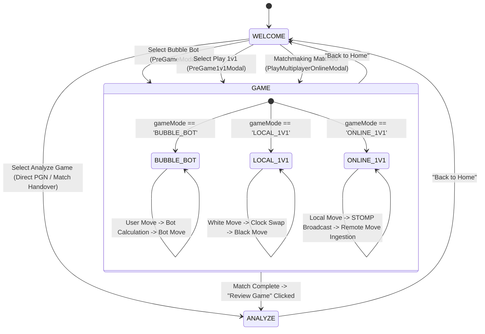

# 🎨 Frontend Architecture & Technical Specification

This document provides an exhaustive, low-level technical reference for the **Frontend Application**, built on **React 19**, **TypeScript 5.7+**, **Vite 8**, **Tailwind CSS**, **Framer Motion**, **react-chessboard**, **chess.js**, and **STOMP WebSockets**.

---

## 1. Executive System Architecture

The frontend application operates as a reactive Single Page Application (SPA) designed to deliver a modern, low-latency chess experience:
- **Zero-Latency Board Interactions**: Instant move validation via `chess.js` and responsive drag-and-drop piece movement via `react-chessboard`.
- **Tri-Modal State Machine**: Smooth navigation between the **Welcome Hub**, **Active Gameplay (AI / Online / Local)**, and **Deep Game Analysis & AI Coach**.
- **Real-Time WebSocket Synchronization**: Sub-millisecond move and chat relay via `@stomp/stompjs` and `sockjs-client`.
- **Integrated Audio & Speech Synthesis**: Procedural Web Audio SFX and browser Web Speech API for AI coach voice commentary.
- **Production Asset Pipeline**: Bundles production builds (`tsc -b && vite build`) directly into Spring Boot's `src/main/resources/static/`, enabling full-stack deployment as a unified standalone JAR.

```
┌────────────────────────────────────────────────────────────────────────────────────────────────────────┐
│                                           APPLICATION ENTRYPOINT                                       │
│                                            (`main.tsx` / `App.tsx`)                                    │
└───────────────────────────────────────────────────┬────────────────────────────────────────────────────┘
                                                    │
                   ┌────────────────────────────────┼────────────────────────────────┐
                   ▼                                ▼                                ▼
┌────────────────────────────────────┐ ┌───────────────────────────┐ ┌───────────────────────────────────┐
│     VIEW MODE: WELCOME             │ │      VIEW MODE: GAME      │ │      VIEW MODE: ANALYZE          │
│   - WelcomePage.tsx                │ │  - ChessBoardContainer    │ │  - AnalyzeGameSection.tsx         │
│   - Floating Ambient Pieces        │ │  - EvaluationBar          │ │  - Move Classification Badges   │
│   - Game Mode Selection Cards      │ │  - EngineStatsPanel       │ │  - Tactical Move Arrows         │
│   - Auth / Profile Drawer          │ │  - ChatPanel (Multiplayer)│ │  - AiCoachPanel & TTS Voice     │
│                                    │ │  - GameControls           │ │                                 │
└────────────────────────────────────┘ └────────────┬──────────────┘ └───────────────────────────────────┘
                                                    │
                               ┌────────────────────┴────────────────────┐
                               │             MODAL LAYER                 │
                               │  - PreGameModal (Bubble Bot AI)         │
                               │  - PreGame1v1Modal (Local & Private)    │
                               │  - PlayMultiplayerOnlineModal (Ranked)  │
                               │  - PromotionModal (Pawn Promotion)      │
                               │  - AnalysisModal (PGN Import/Export)    │
                               └────────────────────┬────────────────────┘
                                                    │
                               ┌────────────────────┴────────────────────┐
                               │           SERVICES & HOOKS              │
                               │  - useChessClock (Dual Timer & Incr)    │
                               │  - WebSocketService (STOMP / SockJS)    │
                               │  - api.ts (Engine & Multiplayer REST)   │
                               │  - authApi.ts (Authentication REST)     │
                               │  - sound.ts (Web Audio Sound Effects)   │
                               │  - voiceSynthesizer.ts (Speech API TTS) │
                               └─────────────────────────────────────────┘
```

---

## 2. Directory Structure & File Map

```
frontend/
├── index.html                            # HTML5 Shell & Google Fonts (Outfit, Inter)
├── package.json                          # Dependencies & build scripts
├── tsconfig.json                         # TypeScript Project References
├── tsconfig.app.json                     # Frontend App TypeScript Configuration
├── vite.config.ts                        # Vite bundler, proxy & static output config
├── vitest.config.ts                      # Vitest unit & DOM testing configuration
└── src/
    ├── App.css                           # Keyframe animations & glassmorphism utilities
    ├── App.tsx                           # Master State Machine, Game Loop & Navigation
    ├── index.css                         # Tailwind CSS base, components & utilities
    ├── main.tsx                          # React 19 root DOM renderer
    ├── __tests__/
    │   ├── setup.ts                      # DOM testing environment setup
    │   └── ui_bugs.test.tsx              # Unit & DOM interaction test suites
    ├── assets/
    │   └── hero.png                      # Brand imagery & static assets
    ├── components/
    │   ├── analysis/
    │   │   ├── AiCoachPanel.tsx          # Multi-persona LLM coach & voice narration
    │   │   └── AnalyzeGameSection.tsx    # Move classification, arrows & accuracy
    │   ├── auth/
    │   │   ├── AuthPage.tsx              # Register & login modal with validation
    │   │   ├── GoogleOAuthButton.tsx     # One-click Google OAuth 2.0 component
    │   │   └── SkillSelectionPage.tsx    # ELO & skill level onboarding picker
    │   ├── chat/
    │   │   └── ChatPanel.tsx             # Scoped auto-scroll match chat panel
    │   ├── chess/
    │   │   ├── ChessBoardContainer.tsx   # Interactive react-chessboard wrapper
    │   │   ├── EngineStatsPanel.tsx      # Stockfish telemetry (Depth, NPS, PV)
    │   │   ├── EvaluationBar.tsx         # Centipawn & mate visual eval gauge
    │   │   ├── GameControls.tsx          # Takeback, Flip Board, Resign, PGN modal
    │   │   ├── MoveHistoryLog.tsx        # Structured SAN move notation list
    │   │   └── PlayerCard.tsx            # Player badge, clock & captured pieces
    │   ├── layout/
    │   │   ├── Footer.tsx                # Application footer with engine badge
    │   │   ├── Navbar.tsx                # Navigation bar, user profile & sound toggle
    │   │   └── WelcomePage.tsx           # Hero header & 4 interactive game mode cards
    │   ├── modals/
    │   │   ├── AnalysisModal.tsx         # PGN import & export dialogue
    │   │   ├── PlayMultiplayerOnlineModal.tsx # Ranked matchmaking with 20s bot fallback
    │   │   ├── PreGame1v1Modal.tsx       # Local Pass & Play & private room codes
    │   │   ├── PreGameModal.tsx          # Stockfish AI ELO slider & time controls
    │   │   └── PromotionModal.tsx        # 4-piece pawn promotion dialogue
    │   └── ui/
    │       ├── Badge.tsx                 # Color-coded status & classification badges
    │       ├── Button.tsx                # Variant-styled action buttons
    │       ├── Card.tsx                  # Glassmorphic card container
    │       ├── ErrorBoundary.tsx         # React error boundary fallback
    │       ├── Modal.tsx                 # Animated modal dialog shell
    │       ├── Slider.tsx                # Custom styled range slider
    │       └── UserAvatar.tsx            # Gravatar/Initial avatar badge
    ├── hooks/
    │   └── useChessClock.ts              # High-precision dual turn timer hook
    ├── services/
    │   ├── api.ts                        # Engine REST API & Multiplayer room client
    │   ├── authApi.ts                    # User registration, login & OAuth client
    │   └── websocket.ts                  # STOMP WebSocket client singleton
    ├── types/
    │   ├── auth.ts                       # User, Session & OAuth interfaces
    │   ├── chess.ts                      # Board themes, move evaluations, DTOs
    │   └── multiplayer.ts                # Rooms, chat, and matchmaking interfaces
    └── utils/
        ├── cn.ts                         # Tailwind class merge utility (clsx + twMerge)
        ├── openingBook.ts                # Grandmaster opening moves & ECO codes
        ├── sound.ts                      # Procedural Web Audio sound effects
        └── voiceSynthesizer.ts           # Browser Web Speech API text-to-speech
```

---

## 3. Core Subsystems Deep Dive

### 3.1 Master State Machine (`App.tsx`)

`App.tsx` acts as the root orchestrator controlling game modes, active turns, and component rendering:



#### Key State Variables:
- `viewMode`: `'WELCOME' | 'GAME' | 'ANALYZE'`
- `gameMode`: `'BUBBLE_BOT' | 'LOCAL_1V1' | 'ONLINE_1V1'`
- `game`: Single mutable `Chess()` instance from `chess.js` managing legal moves, FENs, and game-over checks.
- `currentTurn`: `'white' | 'black'`
- `isEngineThinking`: `boolean` flag locking user interactions while Stockfish computes.
- `chatMessages`: `ChatMessage[]` array populated in real-time via STOMP subscription.

---

### 3.2 Chessboard & Interactive Board Layer

- **Wrapper Component**: [ChessBoardContainer.tsx](file:///d:/Chess%20Engine/frontend/src/components/chess/ChessBoardContainer.tsx)
- **Library**: `react-chessboard`
- **Features**:
  1. **Legal Move Hints**: Renders circular target markers on legal destination squares.
  2. **Pawn Promotion Interception**: When a pawn reaches the 8th/1st rank, intercepts the drop event and opens [PromotionModal.tsx](file:///d:/Chess%20Engine/frontend/src/components/modals/PromotionModal.tsx) for Queen/Rook/Bishop/Knight selection.
  3. **Last Move Highlighting**: Applies subtle amber background tints to source and target squares of the previous move.
  4. **King in Check Highlighting**: Emphasizes the checked king's square with a pulse warning overlay.
  5. **Board Orientation Flipping**: Smoothly inverts perspective (`white` $\leftrightarrow$ `black`).

---

### 3.3 Dual Chess Clock Hook (`useChessClock.ts`)

A dedicated React hook that manages dual-player time controls with sub-second accuracy:

```typescript
const {
  whiteTime,
  blackTime,
  activeColor,
  isRunning,
  startClock,
  stopClock,
  resetClock,
  addIncrement,
  formattedWhiteTime,
  formattedBlackTime,
} = useChessClock({
  initialMinutes: 10,
  incrementSecs: 5,
  onTimeOut: (flaggedColor) => handleGameOverByTimeout(flaggedColor),
});
```

- **Interval Loop**: Uses a `100ms` tick interval tracking elapsed milliseconds via `performance.now()`.
- **Increment Addition**: Automatically adds configured increment seconds to the moving player upon turn completion.
- **Flag Fall Handling**: Triggers `onTimeOut` when milliseconds drop to `0`.

---

### 3.4 Real-Time STOMP WebSocket Client (`websocket.ts`)

Encapsulates `@stomp/stompjs` and `sockjs-client` into an autonomous singleton service:

```typescript
export class WebSocketService {
  private client: Client | null = null;
  private isConnected = false;

  // Establishes connection to /ws-chess with auto-reconnect
  public connect(onConnected?: () => void): Promise<void>;
  
  // Registers browser session ID with room for disconnect forfeit tracking
  public registerPlayerSession(roomId: string, playerId: string): void;
  
  // Subscribes to moves and room state
  public subscribeToRoom(roomId: string, onUpdate: (data: any) => void): StompSubscription;
  
  // Subscribes to live room chat
  public subscribeToChat(roomId: string, onChat: (chat: ChatMessage) => void): StompSubscription;
  
  // Publishes move to /app/room/{roomId}/move
  public sendMove(move: MultiplayerMove): void;
  
  // Publishes chat to /app/room/{roomId}/chat
  public sendChat(chat: ChatMessage): void;
}
```

---

### 3.5 Game Analysis & Move Classification Engine

- **Component**: [AnalyzeGameSection.tsx](file:///d:/Chess%20Engine/frontend/src/components/analysis/AnalyzeGameSection.tsx)
- **Visual Move Arrows**:
  Draws SVG vector arrows directly on the board:
  - **Engine Best Move**: Solid emerald green arrow pointing from source to optimal square.
  - **Player Move**: Color-coded arrow corresponding to the move classification badge (e.g. Red for Blunder, Cyan for Brilliant, Yellow for Inaccuracy).
- **Advantage & Accuracy Overview**:
  - Displays White Accuracy % and Black Accuracy % computed by CAPS formulas.
  - Displays count chips for each classification category.
  - Synchronizes [EvaluationBar.tsx](file:///d:/Chess%20Engine/frontend/src/components/chess/EvaluationBar.tsx) with historical evaluation at each ply.

---

### 3.6 AI Coach & Speech Synthesis Engine

- **Component**: [AiCoachPanel.tsx](file:///d:/Chess%20Engine/frontend/src/components/analysis/AiCoachPanel.tsx)
- **Voice Synthesizer**: [voiceSynthesizer.ts](file:///d:/Chess%20Engine/frontend/src/utils/voiceSynthesizer.ts)
- **Capabilities**:
  - Generates persona-tailored coaching explanations (**Grandmaster**, **Enthusiastic**, **Tactical**) via `/api/ai/coach/commentary`.
  - Converts coach script to spoken audio using `window.speechSynthesis`.
  - Provides speech playback controls (Play, Pause, Stop, Volume/Pitch controls).

---

### 3.7 Audio Engine (`sound.ts`)

Procedural audio synthesizer using standard browser Web Audio API `AudioContext` (zero external MP3 file dependencies):

| Sound Action | Frequency / Waveform | Trigger Event |
|---|---|---|
| **Move** | `440Hz` sine wave pulse ($60\text{ms}$) | Normal piece movement |
| **Capture** | `600Hz` $\rightarrow$ `300Hz` frequency sweep ($100\text{ms}$) | Piece capture |
| **Castle** | Dual `400Hz` + `500Hz` chord | Kingside / Queenside castling |
| **Check** | `880Hz` high-pitch alert | King put in check |
| **Game Over** | Descending minor chord triad | Checkmate, resignation, or timeout |

---

## 4. UI/UX Design System & Animation Engine

### 4.1 Color Palette & Tokens
- **Backgrounds**: Slate dark mode (`bg-slate-900`, `bg-slate-950`), stone light mode (`bg-stone-50`).
- **Brand Accents**:
  - Amber Gold (`text-amber-600`, `border-amber-500`): Classic chess engine accents.
  - Indigo / Cyan (`bg-indigo-600`, `text-cyan-400`): Live ranked matchmaking & online features.
  - Rose (`bg-rose-600`, `border-rose-500`): 1v1 Room Battles.
- **Glassmorphism**: Backdrop blur with translucent borders (`backdrop-blur-md bg-white/80 border border-slate-200/80`).

### 4.2 Framer Motion Animation Catalog
- **Floating Ambient Glyphs**: Background floating chess piece symbols (`♔`, `♕`, `♞`, `♟`) in [WelcomePage.tsx](file:///d:/Chess%20Engine/frontend/src/components/layout/WelcomePage.tsx) with continuous gentle sinusoidal floating.
- **Modal Entry Transitions**: Spring-damped scale and fade-in animations (`scale: 0.95` $\rightarrow$ `scale: 1.0`).
- **Card Hover Shimmers**: 3D elevation hover effects with glowing gradient backdrops.
- **Victory Confetti**: Celebratory multi-color confetti cannon powered by `canvas-confetti` upon win detection.

---

## 5. Automated Testing Architecture

The frontend uses **Vitest** paired with **React Testing Library** and **jsdom**:

- **Configuration**: [vitest.config.ts](file:///d:/Chess%20Engine/frontend/vitest.config.ts)
- **Setup Environment**: [setup.ts](file:///d:/Chess%20Engine/frontend/src/__tests__/setup.ts) (`@testing-library/jest-dom/vitest`)
- **Core Test Suite**: [ui_bugs.test.tsx](file:///d:/Chess%20Engine/frontend/src/__tests__/ui_bugs.test.tsx)

### Covered Test Cases:
| Test ID | Test Category | Target Component | Description |
|---|---|---|---|
| **TC-01** | Pawn Promotion | `PromotionModal` | Verifies Queen, Knight, Rook, Bishop rendering and piece selection callbacks. |
| **TC-02** | Chess Clock | `useChessClock` | Tests clock countdown, increment additions, and timeout events. |
| **TC-03** | Engine Controls | `GameControls` | Verifies Undo/Takeback, Resign, and Legal Move toggle button events. |
| **TC-04** | Chat Sanitization | `ChatPanel` | Verifies empty/whitespace message rejection, disabled button state, and sending. |
| **TC-05** | ELO Selection | `EngineStatsPanel` | Tests real-time ELO rating slider adjustments. |
| **TC-06** | Status Badges | `Badge` | Verifies variant badge styles for move classifications. |

---

## 6. Build & Development Workflow

```bash
# 1. Install Node Dependencies
cd frontend
npm install

# 2. Run Development Server (Vite HMR on http://localhost:5173)
npm run dev

# 3. Run Automated Unit & DOM Tests
npm test

# 4. Compile TypeScript & Build Static Production Bundle
npm run build
```
*(Build output is compiled directly into `src/main/resources/static/` for Spring Boot serving).*
