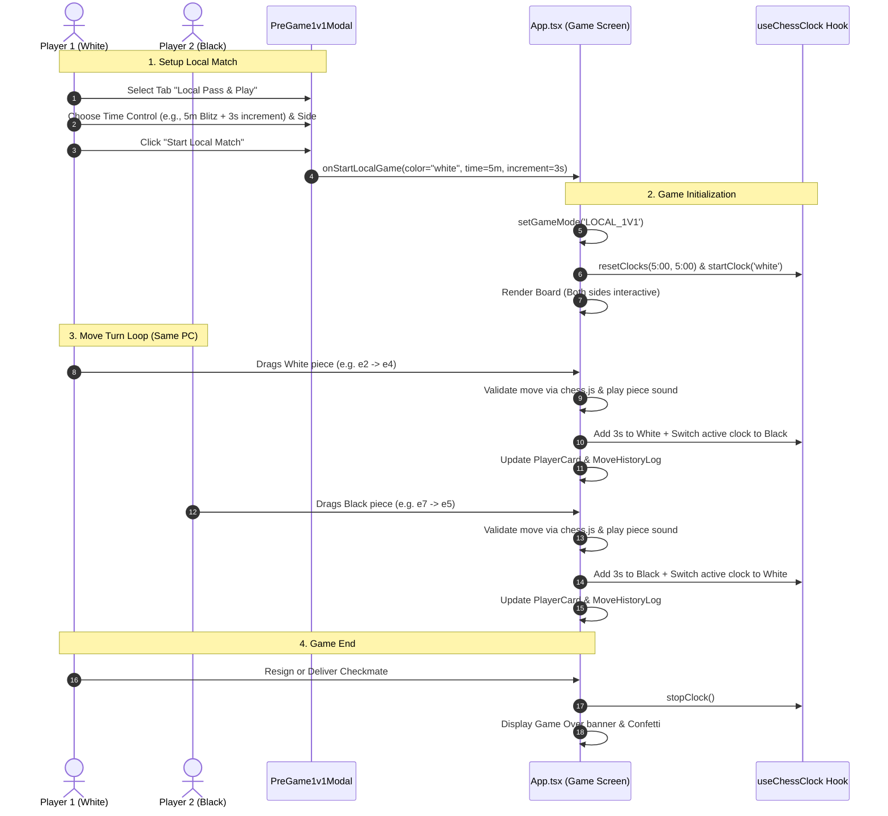
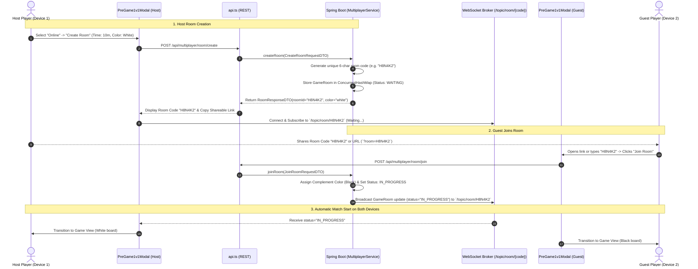
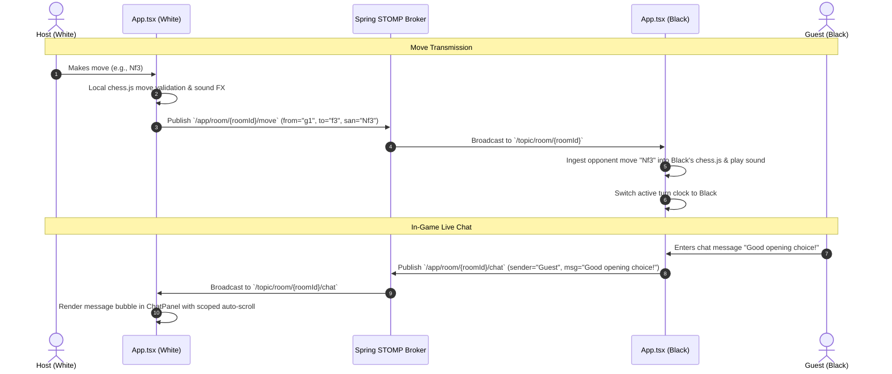

# ⚔️ Play 1 vs 1 (Local Pass & Play & Online Multiple Devices) — Complete Technical Architecture & Workflow Documentation

This document provides a comprehensive end-to-end technical guide for the **Play 1 vs 1** mode, covering both **Local Pass & Play (Same PC / Device)** and **Online Multiple Devices (Private 1v1 Room Battles)** across the **Frontend (React 19 / TypeScript / STOMP WebSocket)** and the **Backend (Java / Spring Boot 3 / In-Memory Concurrent Store)**.

---

## 1. Overview & Architecture

The **Play 1 vs 1** feature is a unified game mode that caters to two distinct play styles from a single modal:

1. **Local Pass & Play (Same Device / PC)**:
   - Zero-network, offline-capable local match on the same browser screen.
   - Both White and Black are fully interactive on the shared board.
   - Dual turn-swapping chess clocks with configurable increments.
   - Ideal for in-person casual play, laptop over-the-board games, or analysis.

2. **Online Multiple Devices (Private 1v1 Room Battles)**:
   - Private room code generation (e.g. `K7X9Q2`) with direct URL sharing (`?room=K7X9Q2`).
   - Cross-device real-time move synchronization via Spring STOMP WebSockets.
   - Color preference negotiation (White, Black, or Random).
   - Integrated live match chat with scoped auto-scrolling.

```
                               ┌─────────────────────────────┐
                               │       WelcomePage.tsx       │
                               │      (Select "Play 1v1")    │
                               └──────────────┬──────────────┘
                                              │
                                              ▼
                               ┌─────────────────────────────┐
                               │      PreGame1v1Modal.tsx    │
                               └──────┬───────────────┬──────┘
                                      │               │
                 ┌────────────────────┘               └────────────────────┐
                 │ Tab 1: Local Pass & Play                                │ Tab 2: Online Multiple Devices
                 ▼                                                         ▼
  ┌───────────────────────────────┐                         ┌───────────────────────────────┐
  │   App.tsx (LOCAL_1V1 Mode)    │                         │   App.tsx (ONLINE_1V1 Mode)   │
  │  - isInteractive: true (Both) │                         │  - isInteractive: my turn only│
  │  - Clocks switch locally      │                         │  - WebSocket STOMP Sync       │
  │  - No network overhead        │                         │  - Live Match ChatPanel       │
  └───────────────────────────────┘                         └───────────────┬───────────────┘
                                                                            │
                                                       WebSocket / STOMP    │ HTTP REST
                                                       `/ws-chess`          │ `/api/multiplayer/`
                                                                            ▼
                                                            ┌───────────────────────────────┐
                                                            │   Spring Boot 3 Backend       │
                                                            │  - MultiplayerController      │
                                                            │  - MultiplayerServiceImpl     │
                                                            │  - Concurrent Room Registry   │
                                                            └───────────────────────────────┘
```

---

## 2. End-to-End Workflow Diagrams

### 2.1 Local Pass & Play (Same Device) Lifecycle



---

### 2.2 Online Multiple Devices Room Creation & Join Flow



---

### 2.3 Cross-Device In-Game Move & Chat Synchronization



---

## 3. Frontend Implementation (`frontend/src/`)

### 3.1 Dual-Mode Configuration Modal (`components/modals/PreGame1v1Modal.tsx`)
- **Tabbed Interface**:
  - `activeTab === 'local'`: Renders side choice, rapid/blitz/bullet presets, and custom time sliders.
  - `activeTab === 'online'`: Toggles between `onlineSubtype === 'create'` (Host) and `'join'` (Guest).
- **Auto-Sync via URL**:
  - Automatically extracts `?room=<ID>` from window URL parameters and opens the modal directly to the Join tab with pre-filled room code.
- **Copy-to-Clipboard with Fallback**:
  - Uses `navigator.clipboard.writeText` with programmatic `textarea` fallback for compatibility across HTTP/HTTPS and mobile browsers.

### 3.2 Main Game Screen Handling (`App.tsx`)

#### Mode: `LOCAL_1V1`
```typescript
// Both players are interactive on the same device
isInteractive={!isGameOver && gameMode === 'LOCAL_1V1'}

// Player cards reflect local player identities
name={boardOrientation === 'white' ? 'Player 2 (Black)' : 'Player 1 (White)'}
```
- **Engine Panels Hidden**: Stockfish evaluation bar and AI telemetry panels are omitted for a distraction-free over-the-board experience.
- **Dual Clock Handling**: On every valid piece drop, `handleMakeMove` swaps the active turn between White and Black and applies the increment.

#### Mode: `ONLINE_1V1`
```typescript
// Only the player whose turn matches their assigned color can move
isInteractive={!isGameOver && currentTurn === userColor}

// Live match chat rendered on the right panel
<ChatPanel
  messages={chatMessages}
  onSendMessage={handleSendChatMessage}
  myPlayerId={myPlayerIdRef.current || myPlayerId}
  opponentName={opponentName}
/>
```
- **WebSocket Subscriptions**:
  - Connects to `/topic/room/{roomId}` to receive opponent moves, resignations, and session departures.
  - Connects to `/topic/room/{roomId}/chat` for live message streaming.

---

## 4. Backend Implementation (`src/main/java/com/chessengine/multiplayer/`)

### 4.1 Room Creation & Join Endpoints (`MultiplayerController.java`)
```java
@PostMapping({"/api/multiplayer/create", "/api/multiplayer/room/create"})
public ResponseEntity<RoomResponseDTO> createRoom(@RequestBody CreateRoomRequestDTO request) {
    RoomResponseDTO response = multiplayerService.createRoom(request);
    return ResponseEntity.ok(response);
}

@PostMapping({"/api/multiplayer/join", "/api/multiplayer/room/join"})
public ResponseEntity<RoomResponseDTO> joinRoom(@RequestBody JoinRoomRequestDTO request) {
    RoomResponseDTO response = multiplayerService.joinRoom(request);
    messagingTemplate.convertAndSend("/topic/room/" + request.getRoomId(), response.getRoom());
    return ResponseEntity.ok(response);
}
```

### 4.2 In-Memory Room Management (`MultiplayerServiceImpl.java`)
- **6-Character Code Generation**: Generates uppercase alphanumeric room IDs avoiding ambiguous characters (e.g. `0` vs `O`, `1` vs `I`).
- **Color Complement Allocation**:
  - If Host requests `white`, Guest receives `black`.
  - If Host requests `random`, a coin toss determines colors at room creation.
- **Thread-Safe State Machine**:
  - `WAITING`: Room created, waiting for Guest.
  - `IN_PROGRESS`: Both players connected, clock and moves active.
  - `COMPLETED`: Game concluded via checkmate, draw, or resignation.

### 4.3 STOMP Messaging Handlers
- `@MessageMapping("/room/{roomId}/move")`: Validates and relays moves to opponent.
- `@MessageMapping("/room/{roomId}/chat")`: Broadcasts chat messages.
- `@MessageMapping("/room/{roomId}/resign")`: Processes forfeiture and marks room `COMPLETED`.
- `@MessageMapping("/room/{roomId}/leave")`: Broadcasts `PLAYER_LEFT` if a player navigates away.

---

## 5. Data Transfer Objects (DTOs)

### `CreateRoomRequestDTO`
```json
{
  "playerName": "Grandmaster Alice",
  "timeControlMinutes": 10.0,
  "incrementSeconds": 5,
  "preferredColor": "white"
}
```

### `JoinRoomRequestDTO`
```json
{
  "roomId": "H8N4K2",
  "playerName": "Challenger Bob"
}
```

### `RoomResponseDTO`
```json
{
  "playerId": "usr_73fa8b12",
  "playerColor": "white",
  "room": {
    "roomId": "H8N4K2",
    "whitePlayerId": "usr_73fa8b12",
    "whitePlayerName": "Grandmaster Alice",
    "blackPlayerId": null,
    "blackPlayerName": null,
    "status": "WAITING",
    "timeControlMinutes": 10.0,
    "currentTurn": "white",
    "moveHistory": []
  }
}
```

---

## 6. Resilience & Edge Cases

| Scenario | Mode | Handling Mechanism |
|---|---|---|
| **Pasted Invite Link** | Online 1v1 | Extracted query parameter `?room=CODE` auto-opens modal directly in Join state with code pre-filled. |
| **Joining Full / In-Progress Room** | Online 1v1 | Backend rejects with `HTTP 400` / `Room full or already active` and alerts user gracefully. |
| **Accidental Tab Close** | Online 1v1 | `WebSocketEventListener` detects socket closure and sends `PLAYER_LEFT` to opponent. |
| **Chat Viewport Jumping Bug** | Online 1v1 | Scoped container scrolling in `ChatPanel.tsx` prevents page jump, keeping the board fixed on screen. |
| **Offline Play on Same Laptop** | Local Pass & Play | Zero API calls required; all validation and timing runs purely inside the browser. |

---

## 7. Verification & Run Commands

```bash
# 1. Start Spring Boot Backend
mvn spring-boot:run

# 2. Run Frontend Dev Server
cd frontend
npm run dev

# 3. Test Across Two Browser Windows
# Window 1: Create Room -> Copy Code
# Window 2: Join with Code -> Play in real-time
```
