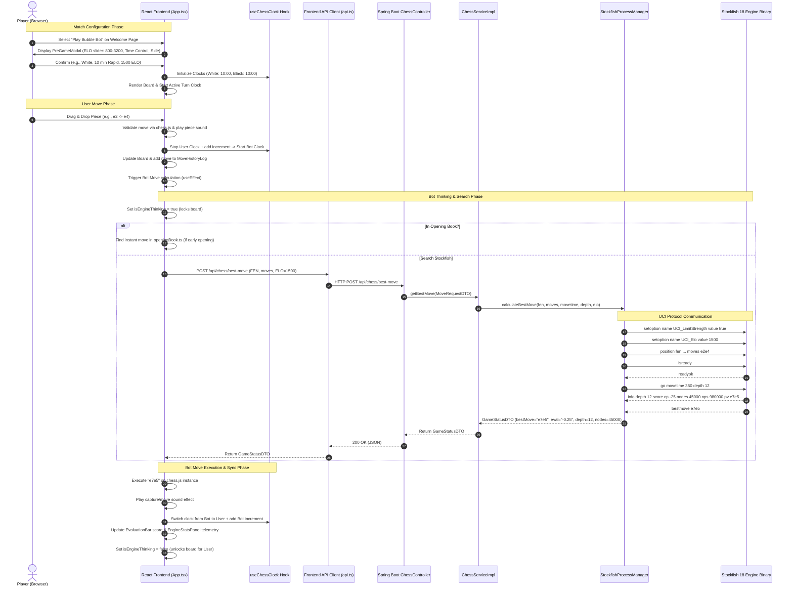
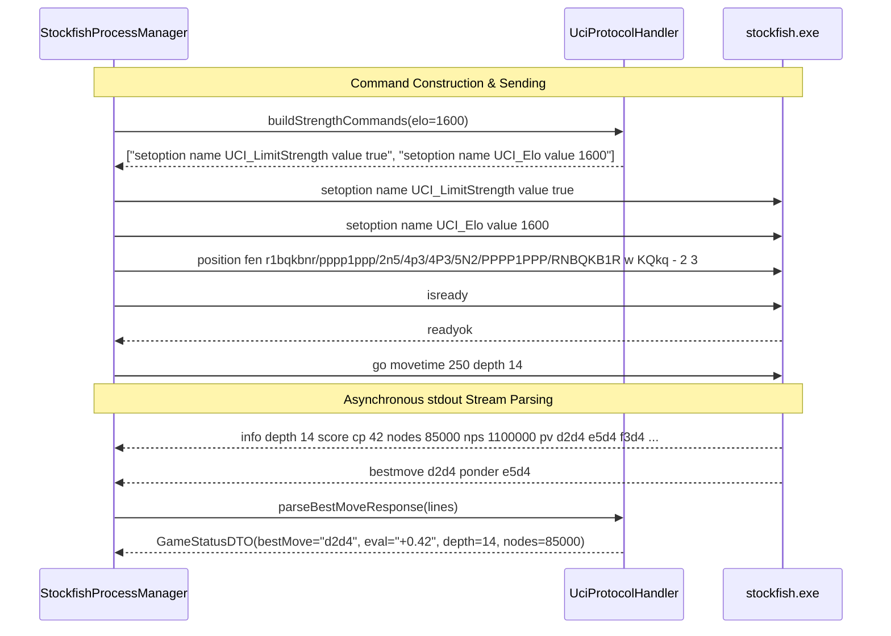

# 🤖 Play Bubble Bot — Complete Technical Architecture & Workflow Documentation

This document provides a comprehensive end-to-end technical guide for the **Play Bubble Bot (VS Stockfish 18 AI)** mode across both the **Frontend (React 19 / Vite / TypeScript)** and the **Backend (Java / Spring Boot 3 / Stockfish UCI Engine)**.

---

## 1. Overview & Architecture

**Play Bubble Bot** allows users to play against a full-strength or handicap-adjusted **Stockfish 18 AI engine** directly in the browser with real-time evaluation, dynamic ELO scaling (800 to 3200 ELO), multi-time-control chess clocks, sound effects, opening book acceleration, takebacks, and in-depth engine telemetry (Depth, Nodes, NPS, Centipawn score).

```
┌────────────────────────────────────────────────────────────────────────────┐
│                              FRONTEND (React 19)                           │
│                                                                            │
│   ┌─────────────────┐   ┌───────────────────────────┐   ┌──────────────┐   │
│   │  PreGameModal   │──▶│   App.tsx (Game Loop)     │◀─▶│ useChessClock│   │
│   │ (ELO/Time/Side) │   │  - chess.js (Game State)  │   │ (Timers)     │   │
│   └─────────────────┘   └─────────────┬─────────────┘   └──────────────┘   │
│                                       │                                    │
│                    ┌──────────────────┼──────────────────┐                 │
│                    ▼                  ▼                  ▼                 │
│         ┌────────────────────┐ ┌───────────────┐ ┌───────────────┐         │
│         │ChessBoardContainer │ │ EvaluationBar │ │EngineStatsPane│         │
│         │ (react-chessboard) │ │ (Win Rate/CP) │ │ (Depth/NPS/PV)│         │
│         └────────────────────┘ └───────────────┘ └───────────────┘         │
└───────────────────────────────────────┬────────────────────────────────────┘
                                        │ HTTP REST (`/api/chess/best-move`)
                                        ▼
┌────────────────────────────────────────────────────────────────────────────┐
│                          BACKEND (Spring Boot 3)                           │
│                                                                            │
│   ┌────────────────────────────────────────────────────────────────────┐   │
│   │  ChessController.java (`POST /api/chess/best-move`)                │   │
│   └─────────────────────────────────┬──────────────────────────────────┘   │
│                                     ▼                                      │
│   ┌────────────────────────────────────────────────────────────────────┐   │
│   │  ChessServiceImpl.java (ELO tuning, dynamic movetime & depth)      │   │
│   └─────────────────────────────────┬──────────────────────────────────┘   │
│                                     ▼                                      │
│   ┌────────────────────────────────────────────────────────────────────┐   │
│   │  StockfishProcessManager.java (Thread-safe Process I/O Pool)       │   │
│   └─────────────────────────────────┬──────────────────────────────────┘   │
│                                     ▼                                      │
│   ┌────────────────────────────────────────────────────────────────────┐   │
│   │  UciProtocolHandler.java (UCI string commands & output parsing)    │   │
│   └─────────────────────────────────┬──────────────────────────────────┘   │
└─────────────────────────────────────┼──────────────────────────────────────┘
                                      │ Standard I/O (Piped Streams)
                                      ▼
┌────────────────────────────────────────────────────────────────────────────┐
│                    NATIVE STOCKFISH 18 UCI PROCESS                         │
│                           (`bin/stockfish.exe`)                            │
└────────────────────────────────────────────────────────────────────────────┘
```

---

## 2. End-to-End Workflow Diagram

The following Mermaid diagram visualizes the complete lifecycle: match configuration, player turn execution, backend Stockfish computation, and state synchronizations.



---

## 3. Frontend Architecture (`frontend/src/`)

### 3.1 Match Setup (`components/modals/PreGameModal.tsx`)
The pre-game configuration modal allows players to customize:
- **Engine ELO Rating**: Slider from `800` (Beginner) to `3200` (Super Grandmaster).
- **Time Controls**:
  - *Bullet*: 1m | 1m + 1s | 2m + 1s
  - *Blitz*: 3m | 3m + 2s | 5m | 5m + 5s
  - *Rapid*: 10m | 15m + 10s | 30m
  - *Classical*: 60m | 90m + 30s
  - *Custom*: User-defined minutes (1–180m) and increment seconds (0–60s).
- **Side Selection**: White, Black, or Random 50/50 coinflip.

### 3.2 Main Game Engine Loop (`App.tsx`)
1. **Game State Initialization**:
   - `gameMode`: Set to `'BUBBLE_BOT'`.
   - `game`: Instantiates a `Chess()` instance from `chess.js`.
   - `movesSanRef` & `moveHistory`: Tracks SAN strings (`e4`, `Nf3`, `exd5`) and UCI LAN moves (`e2e4`, `g1f3`).
2. **Autonomous Bot Turn Trigger (`useEffect`)**:
   ```typescript
   useEffect(() => {
     if (gameMode !== 'BUBBLE_BOT') return;
     if (isGameOver || isEngineThinking) return;

     // When current turn belongs to the Bot
     if (currentTurn !== userColor) {
       makeEngineMove();
     }
   }, [currentTurn, gameMode, isGameOver, userColor]);
   ```
3. **Execution & Evaluation Update**:
   - When the bot replies, `handleMakeMove` updates `game`, triggers sounds via `soundFx.playMove()` / `soundFx.playCapture()`, and updates the evaluation bar:
   ```typescript
   const updateEvaluation = useCallback(async (fen: string) => {
     const status = await api.getBestMove({ fen, elo, depth: 10, movetime: 150 });
     setEngineStats(status);
   }, [elo]);
   ```

### 3.3 Key In-Game Components
- **[ChessBoardContainer.tsx](file:///d:/Chess%20Engine/frontend/src/components/chess/ChessBoardContainer.tsx)**:
  - Wraps `react-chessboard` with smooth piece drag-and-drop, legal move highlights, last move square highlights, pre-move prevention, and pawn promotion modal triggers.
- **[EvaluationBar.tsx](file:///d:/Chess%20Engine/frontend/src/components/chess/EvaluationBar.tsx)**:
  - Converts centipawns or mate-in-N scores into visual height percentage:
    $$\text{Win\%} = 50 + 50 \times \left(\frac{2}{1 + e^{-0.00368208 \times \text{cp}}} - 1\right)$$
  - Renders smooth transition animations with mate indicators (`M2`, `-M4`).
- **[EngineStatsPanel.tsx](file:///d:/Chess%20Engine/frontend/src/components/chess/EngineStatsPanel.tsx)**:
  - Displays real-time Stockfish telemetry: **Depth**, **Nodes computed**, **Nodes Per Second (NPS)**, **Calculation Time (ms)**, and **Principal Variation (PV)**.
  - Allows adjusting the ELO in real-time during an active match without resetting the board.
- **[GameControls.tsx](file:///d:/Chess%20Engine/frontend/src/components/chess/GameControls.tsx)**:
  - **Takeback (Undo Move)**: Reverts 2 plies (User move + Bot response) and recalibrates clock time and evaluation.
  - **Flip Board**: Inverts orientation (`white` $\leftrightarrow$ `black`).
  - **Resign**: Forfeits the match immediately.
  - **Toggle Legal Moves**: Enables/disables target circle hints on squares.
- **[useChessClock.ts](file:///d:/Chess%20Engine/frontend/src/hooks/useChessClock.ts)**:
  - High-precision 100ms interval timer that decrements the active side's time, adds increment seconds on move completion, and triggers `onTimeOut` on flag fall.

---

## 4. Backend Architecture (`src/main/java/com/chessengine/`)

### 4.1 REST Controller (`controller/ChessController.java`)
Exposes the core AI engine endpoints:
- `GET /api/chess/status`: Health check, confirms Stockfish process is alive and returns engine metadata.
- `POST /api/chess/best-move`: Accepts `MoveRequestDTO` and computes the optimal move.
- `POST /api/chess/analyze`: Performs full deep-game analysis across every move.
- `POST /api/chess/config`: Modifies engine threads, hash size, and defaults.

### 4.2 Business Logic (`service/impl/ChessServiceImpl.java`)
- **Dynamic Search Adaptation**: Adjusts search time and depth to emulate human skill at various ELO ratings:
  ```java
  @Override
  public GameStatusDTO getBestMove(MoveRequestDTO request) {
      return engineManager.calculateBestMove(
              request.getFen(),
              request.getMoves(),
              request.getMovetime(),
              request.getDepth(),
              request.getElo()
      );
  }
  ```

### 4.3 Native Process Management (`engine/process/StockfishProcessManager.java`)
Manages the OS child process `bin/stockfish.exe`:
1. **Lifecycle Management**:
   - `@PostConstruct init()`: Validates binary existence via `StockfishInstaller` and spawns process with redirected error streams.
   - `@PreDestroy cleanup()`: Sends `quit` command and cleanly terminates process.
2. **Thread Safety**:
   - `calculateBestMove(...)` is `synchronized` to ensure concurrent HTTP requests from players are queued and processed sequentially without interleaved UCI stdout/stdin collisions.
3. **Automatic Process Recovery**:
   - If the Stockfish binary crashes or hangs, the process manager detects `process == null || !process.isAlive()` and restarts the engine transparently.

### 4.4 UCI Protocol Handler (`engine/uci/UciProtocolHandler.java`)
Translates high-level chess requests into low-level UCI commands:



---

## 5. Data Transfer Objects (DTOs)

### `MoveRequestDTO`
```json
{
  "fen": "rnbqkbnr/pppppppp/8/8/4P3/8/PPPP1PPP/RNBQKBNR b KQkq e3 0 1",
  "moves": ["e2e4"],
  "elo": 1500,
  "depth": 12,
  "movetime": 250
}
```

### `GameStatusDTO`
```json
{
  "bestMove": "e7e5",
  "ponderMove": "g1f3",
  "evaluation": "+0.15",
  "scoreType": "cp",
  "scoreValue": 15,
  "depth": 12,
  "nodes": 48210,
  "nps": 1050000,
  "timeMs": 248,
  "pv": "e7e5 g1f3 b8c6 f1c4",
  "gameOver": false,
  "winner": null
}
```

---

## 6. Edge Cases & Resilience Mechanisms

| Scenario | Handled By | Mechanism |
|---|---|---|
| **Rapid User Clicks / Spammed Moves** | `App.tsx` | `isEngineThinking` state lock prevents user from moving while bot is calculating. |
| **Move Takeback / Undo** | `App.tsx` (`handleUndoClick`) | Undoes 2 half-moves (`game.undo()` twice), resets `movesSanRef`, updates board state and recalculates evaluation for user. |
| **Instant Opening Play** | `openingBook.ts` | Matches current FEN against a database of grandmaster openings to return instant moves without waiting for engine latency. |
| **Stockfish Process Crash** | `StockfishProcessManager` | Checks `!process.isAlive()` on every invocation; restarts engine automatically. |
| **Checkmate / Stalemate / Draw** | `chess.js` & `App.tsx` | Evaluates `isCheckmate()`, `isDraw()`, `isThreefoldRepetition()`, `isInsufficientMaterial()`; halts clocks, plays game-over sound, and triggers confetti on win. |
| **Time Expiration** | `useChessClock` | Triggers `onTimeOut(color)` when clock reaches `00:00`, awarding victory to the non-flagged player. |

---

## 7. Development & Verification Commands

```bash
# 1. Run Frontend in Dev Mode
cd frontend
npm run dev

# 2. Run Automated UI & Engine Unit Tests
cd frontend
npm test

# 3. Build Static Bundle for Spring Boot
cd frontend
npm run build

# 4. Start Spring Boot Server with Native Stockfish
mvn spring-boot:run
```
