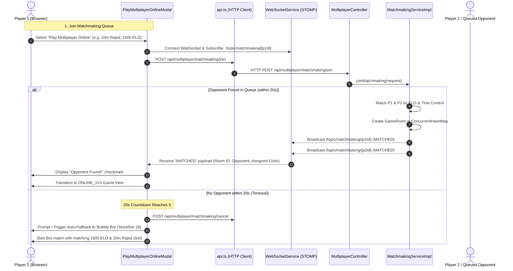
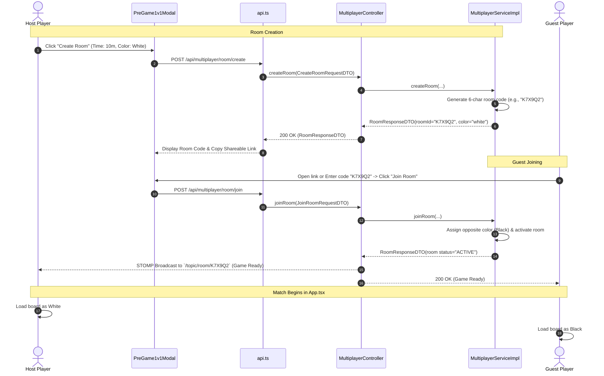
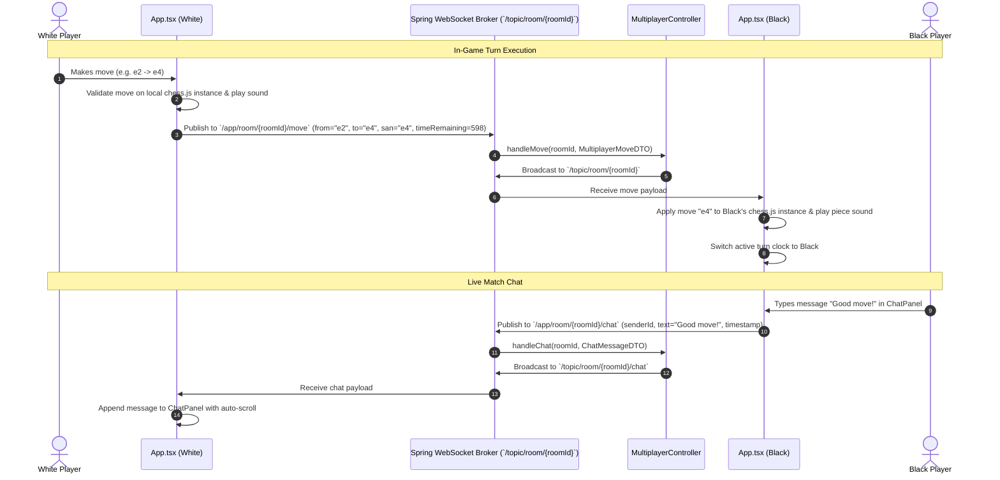

# 🌐 Play Multiplayer Online — Complete Technical Architecture & Workflow Documentation

This document provides a comprehensive end-to-end technical guide for the **Play Multiplayer Online** and **Private 1v1 Room Battles** features across both the **Frontend (React 19 / TypeScript / STOMP WebSocket)** and the **Backend (Java / Spring Boot 3 / Spring WebSocket / Concurrent In-Memory Store)**.

---

## 1. Overview & Architecture

The **Play Multiplayer Online** system provides two real-time multiplayer modalities:
1. **Global Ranked Matchmaking**: Matches players with similar ELO ratings and time controls with an **automatic 20-second Stockfish Bot fallback** if no human opponent is found in time.
2. **Private 1v1 Custom Rooms**: Instant 6-character room code generation, direct URL sharing, side preference negotiation, and direct battle matching.

### High-Level Architectural Flow

```
┌────────────────────────────────────────────────────────────────────────────┐
│                              FRONTEND (React 19)                           │
│                                                                            │
│  ┌──────────────────────────────┐        ┌──────────────────────────────┐  │
│  │ PlayMultiplayerOnlineModal   │        │ PreGame1v1Modal              │  │
│  │ (Matchmaking & 20s Fallback) │        │ (Private 1v1 Room Codes)     │  │
│  └──────────────┬───────────────┘        └──────────────┬───────────────┘  │
│                 │                                       │                  │
│                 └───────────────────┬───────────────────┘                  │
│                                     ▼                                      │
│                         ┌───────────────────────┐                          │
│                         │   App.tsx Game Loop   │                          │
│                         │  (ONLINE_1V1 Mode)    │                          │
│                         └───────────┬───────────┘                          │
│                                     │                                      │
│                 ┌───────────────────┴───────────────────┐                  │
│                 ▼                                       ▼                  │
│     ┌───────────────────────┐               ┌───────────────────────┐      │
│     │ WebSocketService.ts   │               │ ChatPanel.tsx         │      │
│     │ (STOMP / SockJS)      │               │ (Live Match Chat)     │      │
│     └───────────┬───────────┘               └───────────┬───────────┘      │
└─────────────────┼───────────────────────────────────────┼──────────────────┘
                  │                                       │
                  │ WebSocket (STOMP over SockJS)         │ HTTP REST
                  │ Endpoint: `/ws-chess`                 │ Prefix: `/api/multiplayer/`
                  ▼                                       ▼
┌────────────────────────────────────────────────────────────────────────────┐
│                          BACKEND (Spring Boot 3)                           │
│                                                                            │
│   ┌────────────────────────────────────────────────────────────────────┐   │
│   │ MultiplayerController.java                                         │   │
│   │ - REST API: `/api/multiplayer/matchmaking/*`, `/room/*`            │   │
│   │ - STOMP: `@MessageMapping("/room/{roomId}/*")`                     │   │
│   └─────────────────┬──────────────────────────────────┬───────────────┘   │
│                     │                                  │                   │
│                     ▼                                  ▼                   │
│   ┌─────────────────────────────────┐  ┌───────────────────────────────┐   │
│   │ MatchmakingServiceImpl.java     │  │ MultiplayerServiceImpl.java   │   │
│   │ - ELO Proximity Queue           │  │ - Concurrent Room Store       │   │
│   │ - Dual STOMP Notifications      │  │ - Move & Clock Sync           │   │
│   └─────────────────────────────────┘  └───────────────┬───────────────┘   │
│                                                        │                   │
│                                                        ▼                   │
│                                        ┌───────────────────────────────┐   │
│                                        │ WebSocketEventListener.java   │   │
│                                        │ (Session Disconnect & Forfeit)│   │
│                                        └───────────────────────────────┘   │
└────────────────────────────────────────────────────────────────────────────┘
```

---

## 2. End-to-End Workflow Diagrams

### 2.1 Global Matchmaking with 20s Bot Fallback



---

### 2.2 Private 1v1 Room Code Battle



---

### 2.3 Real-Time STOMP Move Synchronization & Match Chat



---

## 3. Frontend Implementation (`frontend/src/`)

### 3.1 Global Matchmaking Modal (`components/modals/PlayMultiplayerOnlineModal.tsx`)
- **State Machine**:
  - `'idle'` $\rightarrow$ `'searching'` (starts 20s countdown and polls/subscribes) $\rightarrow$ `'matched'` (triggers countdown to game start) OR `'bot_fallback'` (seamlessly spawns Stockfish AI match).
- **Matchmaking Subscriptions**:
  - Subscribes to dynamic STOMP topic `/topic/matchmaking/{myPlayerId}`.
  - Automatically cancels waiting ticket on modal close or unmount.

### 3.2 Private 1v1 Room Modal (`components/modals/PreGame1v1Modal.tsx`)
- **Room Code Generator**: Creates short uppercase room keys for easy mobile sharing.
- **Copy to Clipboard**: One-click room link sharing with visual feedback.
- **Side Negotiation**: Allows Host to choose White, Black, or Random; Guest automatically receives the complement.

### 3.3 Live Match Chat (`components/chat/ChatPanel.tsx`)
- **Scoped Inner Container Auto-Scroll**:
  Uses `messagesContainerRef.current.scrollTop = messagesContainerRef.current.scrollHeight` on the message container rather than `scrollIntoView()`, completely preventing window/document jumping and preserving board visibility.
- **Sanitization**: Disables send button on whitespace-only input with `maxLength={200}`.
- **Opponent Metadata**: Renders opponent name tags, timestamp chips, and distinct color-coded bubbles.

### 3.4 WebSocket Client Service (`services/websocket.ts`)
Manages STOMP connections using `@stomp/stompjs` and `sockjs-client`:
- **Auto-Reconnect**: Configured with `reconnectDelay: 5000` and heartbeats (`4000ms`).
- **Session Registration**: Sends `/app/room/{roomId}/register` on connection to pair the HTTP session ID with the player ID for disconnect tracking.
- **Subscriptions**:
  - `/topic/room/{roomId}`: Receives opponent moves, resignations, and takeback requests.
  - `/topic/room/{roomId}/chat`: Receives live chat messages.

---

## 4. Backend Implementation (`src/main/java/com/chessengine/multiplayer/`)

### 4.1 WebSocket & STOMP Configuration (`config/WebSocketConfig.java`)
```java
@Configuration
@EnableWebSocketMessageBroker
public class WebSocketConfig implements WebSocketMessageBrokerConfigurer {

    @Override
    public void registerStompEndpoints(StompEndpointRegistry registry) {
        registry.addEndpoint("/ws-chess")
                .setAllowedOriginPatterns("*")
                .withSockJS();
    }

    @Override
    public void configureMessageBroker(MessageBrokerRegistry registry) {
        registry.enableSimpleBroker("/topic");
        registry.setApplicationDestinationPrefixes("/app");
    }
}
```

### 4.2 Multiplayer Controller (`multiplayer/controller/MultiplayerController.java`)
Exposes both HTTP REST endpoints and STOMP message endpoints:
- **REST Endpoints**:
  - `POST /api/multiplayer/matchmaking/join`: Enqueues player in matchmaking.
  - `POST /api/multiplayer/matchmaking/cancel`: Removes player from queue.
  - `GET /api/multiplayer/matchmaking/status/{playerId}`: Returns current ticket status (`QUEUED`, `MATCHED`, `NOT_FOUND`).
  - `POST /api/multiplayer/room/create`: Creates a new custom private room.
  - `POST /api/multiplayer/room/join`: Joins an existing room by code.
- **STOMP Message Handlers**:
  - `@MessageMapping("/room/{roomId}/move")`: Relays player moves to opponent.
  - `@MessageMapping("/room/{roomId}/chat")`: Relays chat messages to opponent.
  - `@MessageMapping("/room/{roomId}/resign")`: Broadcasts resignation event.
  - `@MessageMapping("/room/{roomId}/register")`: Registers active session in `WebSocketEventListener`.

### 4.3 Matchmaking Service (`multiplayer/service/impl/MatchmakingServiceImpl.java`)
- **Thread-Safe Concurrent Queue**: Uses `ConcurrentHashMap<String, QueueTicket>` for waiting players.
- **Proximity Matching Algorithm**:
  - Checks for exact or bucketed time control compatibility.
  - Finds the opponent in the queue with the minimal ELO difference ($|\text{ELO}_1 - \text{ELO}_2|$).
- **Dual WebSocket Notification**:
  When two players match, sends instant `MATCHED` STOMP payloads to both `/topic/matchmaking/{p1Id}` and `/topic/matchmaking/{p2Id}`.

### 4.4 In-Memory Room Registry (`multiplayer/service/impl/MultiplayerServiceImpl.java`)
- Maintains active game rooms in a `ConcurrentHashMap<String, GameRoom>`:
  ```java
  public class GameRoom {
      private String roomId;
      private String whitePlayerId;
      private String whitePlayerName;
      private String blackPlayerId;
      private String blackPlayerName;
      private String currentTurn;
      private String status; // "WAITING", "ACTIVE", "COMPLETED"
      private double timeControlMinutes;
      private List<String> moveHistory;
  }
  ```

### 4.5 Disconnect & Session Listener (`multiplayer/listener/WebSocketEventListener.java`)
- Listens to Spring `SessionDisconnectEvent`.
- If a connected player unexpectedly drops or closes their browser tab, looks up their registered `roomId` and broadcasts a `PLAYER_LEFT` payload on `/topic/room/{roomId}`, automatically awarding the win to the remaining player.

---

## 5. Data Transfer Objects (DTOs)

### `MatchmakingRequestDTO`
```json
{
  "playerId": "usr_9481a8c2",
  "playerName": "Grandmaster Alex",
  "elo": 1650,
  "timeControlMinutes": 10.0,
  "incrementSeconds": 0,
  "category": "rapid",
  "preferredColor": "random"
}
```

### `MultiplayerMoveDTO`
```json
{
  "roomId": "K7X9Q2",
  "playerId": "usr_9481a8c2",
  "from": "e2",
  "to": "e4",
  "promotion": null,
  "san": "e4",
  "fen": "rnbqkbnr/pppppppp/8/8/4P3/8/PPPP1PPP/RNBQKBNR b KQkq e3 0 1",
  "whiteTimeMs": 598000,
  "blackTimeMs": 600000
}
```

### `ChatMessageDTO`
```json
{
  "roomId": "K7X9Q2",
  "senderId": "usr_9481a8c2",
  "senderName": "Grandmaster Alex",
  "message": "Well played!",
  "timestamp": 1724520300000
}
```

---

## 6. Resilience & Security Features

| Feature | Implementation | Description |
|---|---|---|
| **Sticky Board Viewport Fix** | `ChatPanel.tsx` | Scoped `scrollTop` replaces `scrollIntoView()` to ensure sending chat messages never forces the chessboard out of view. |
| **STOMP Auto-Reconnect** | `WebSocketService.ts` | Automatically recovers connections with exponential backoff on intermittent network drops. |
| **Abrupt Tab Close Detection** | `WebSocketEventListener.java` | Detects socket disconnections and notifies the opponent of abandonment. |
| **Input Sanitization** | `ChatPanel.tsx` & `MultiplayerController` | Prevents whitespace-only chat submissions and bounds message size to 200 characters. |
| **20s Fallback Guarantee** | `PlayMultiplayerOnlineModal` | Ensures players never wait indefinitely in matchmaking by seamlessly initiating a Stockfish 18 match at their target rating. |

---

## 7. Verification & Run Commands

```bash
# 1. Start Spring Boot Server with WebSocket Broker
mvn spring-boot:run

# 2. Run Frontend Dev Server
cd frontend
npm run dev

# 3. Run Automated Tests
cd frontend
npm test
```
